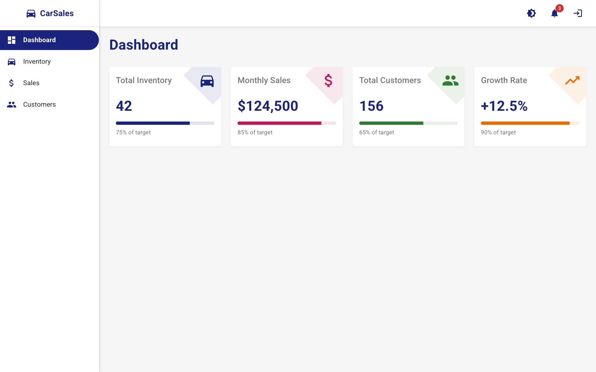
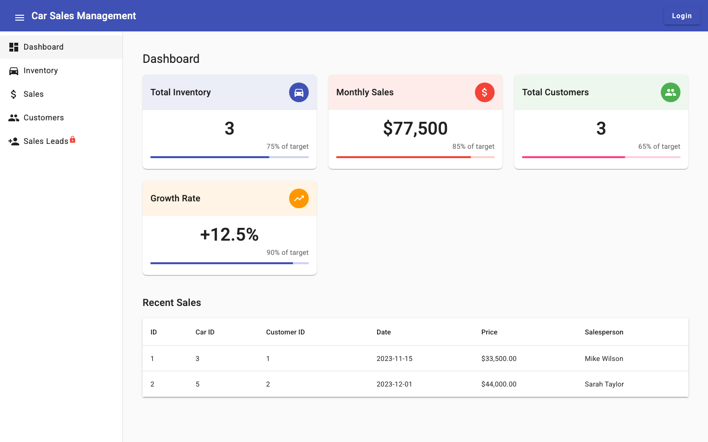
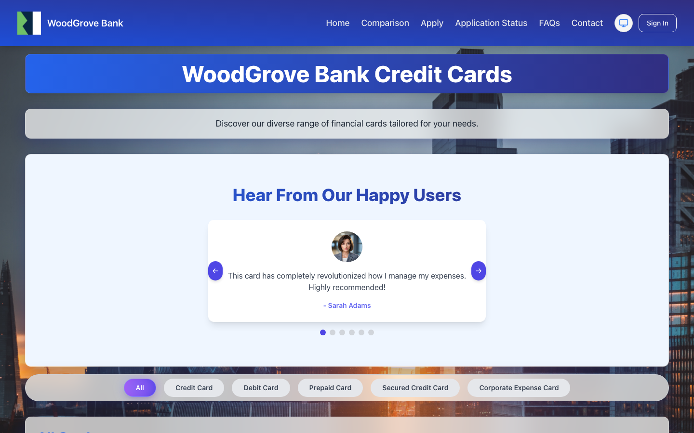
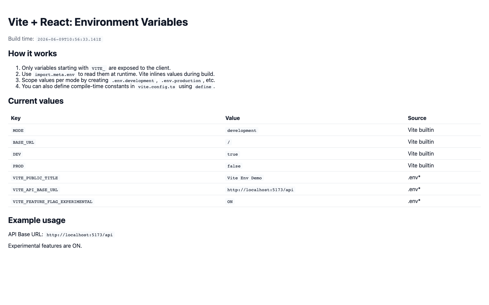
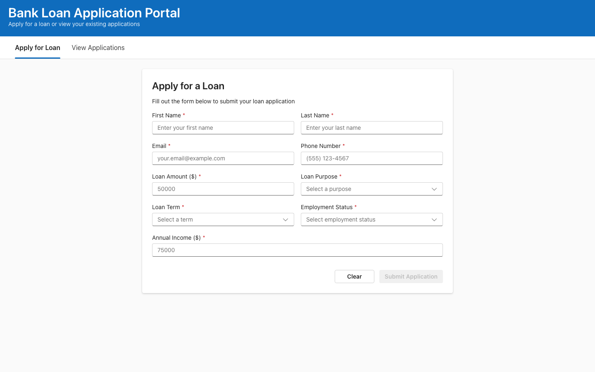
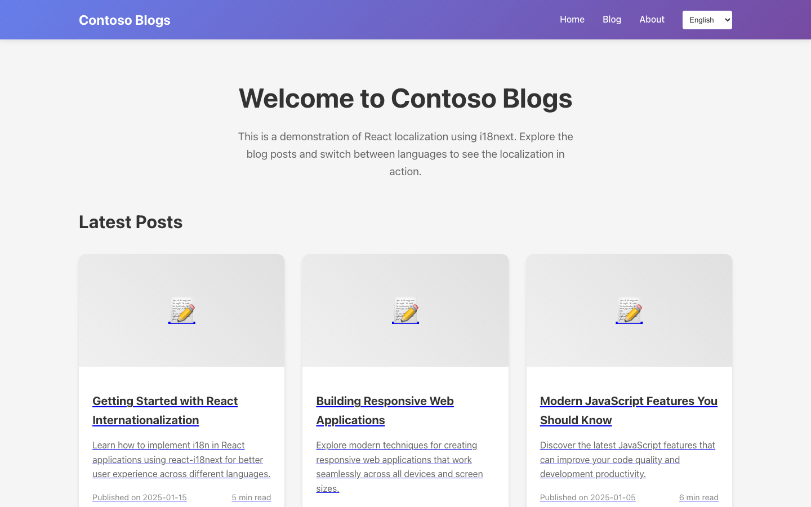
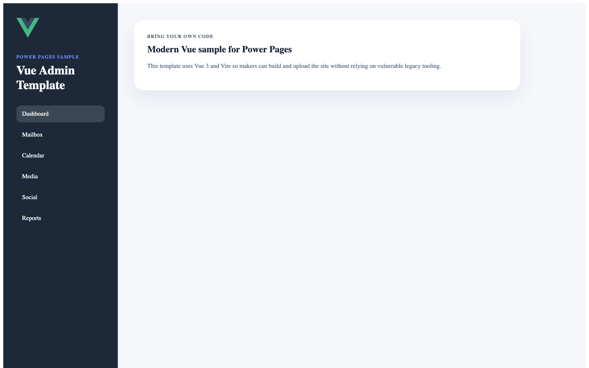
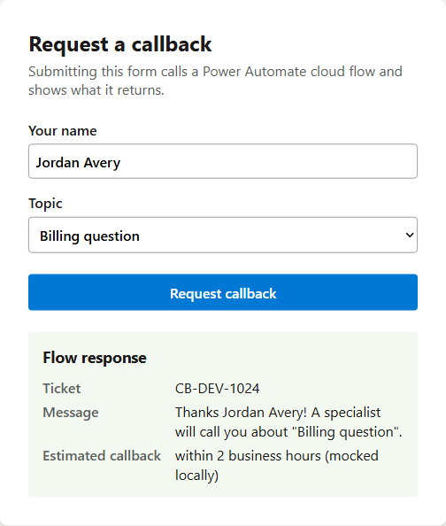

# Power Pages Samples

This repository contains sample code sites for Microsoft Power Pages. Use the table below to quickly find a sample by framework, scenario, or Power Pages capability.

Each sample includes its own README with setup steps, deployment notes, and a screenshot so you can preview the experience before running it locally.

## Samples at a glance

| Preview | Sample | Framework | Use this sample to learn |
| --- | --- | --- | --- |
|  | [Car Sales Website](samples/spa/react/car-sales-website/) | React + Vite | Build a dashboard-style code site with authentication, web roles, virtual tables, and Power Pages Web API integration. |
|  | [Car Sales Website](samples/spa/angular/car-sales-website/) | Angular | Use Angular CLI to build and upload a Power Pages code site based on the car sales scenario. |
|  | [Credit Cards Website](samples/spa/react/credit-cards-website/) | React + Vite | Create a customer-facing banking site with card browsing, applications, reviewer workflows, authentication, authorization, and Web API calls. |
|  | [Environment Variables Demo](samples/spa/react/environment-variables-samples/vite-framework/) | React + Vite | Understand how Vite exposes client-safe environment variables and compile-time constants. |
|  | [Fluent UI Bank Loan Application](samples/spa/react/fluent-ui-sample/) | React + Fluent UI | Build a form-driven portal using Fluent UI v9 controls, state management, and a dashboard-style data grid. |
|  | [Localization Sample](samples/spa/react/localization-sample/) | React + i18next | Add multilingual content, language switching, and localization patterns to a Power Pages code site. |
|  | [Authentication Sample](samples/spa/react/authentication-sample/) | React + Vite | Explore local sign-in, registration, password reset, invitation redemption, external sign-in, terms acceptance, and role-protected content. |
|  | [Vue Admin Template](samples/spa/vue/vue-admin-template/) | Vue + Vite | Start from a Vue 3 admin-style template that can be uploaded as a Power Pages code site. |
|  | [Cloud Flow Sample](samples/spa/react/cloud-flow-sample/) | React + Vite | Invoke a registered Power Automate cloud flow from a code site with the CSRF token, and render its response. |
|  | [File Upload (Notes) Sample](samples/spa/react/file-upload-sample/) | React | Upload, list, download, and delete files via the Web API, stored as Dataverse notes (annotations). |
|  | [File Upload (File Column) Sample](samples/spa/react/file-upload-file-column-sample/) | React | Upload, list, download, and delete files via the Web API, stored in a native Dataverse File column (binary, no base64). |

## Sample categories

- [SPA Samples](samples/spa/) - code-site samples that use popular frontend frameworks and can be uploaded to Power Pages with the Power Platform CLI.

## Resources

- [Get started with Power Pages tutorials](https://learn.microsoft.com/en-us/power-pages/getting-started/tutorial-overview)
- [Building websites with Power Pages - Online workshop](https://learn.microsoft.com/en-us/training/paths/power-pages-online-workshop/)
- [Power Platform developer docs](https://learn.microsoft.com/power-platform/developer)

## Contributing

See [CONTRIBUTING.md](CONTRIBUTING.md) for contribution guide.

## License

The code in this repo is licensed under the [MIT](LICENSE.txt) license.

---
Trademarks This project may contain trademarks or logos for projects, products, or services. Authorized use of Microsoft trademarks or logos is subject to and must follow Microsoft’s Trademark & Brand Guidelines. Use of Microsoft trademarks or logos in modified versions of this project must not cause confusion or imply Microsoft sponsorship. Any use of third-party trademarks or logos are subject to those third-party’s policies.
