# Power Pages Samples

This repository contains sample code sites for Microsoft Power Pages. Use the table below to quickly find a sample by framework, scenario, or Power Pages capability.

Each sample includes its own README with setup steps, deployment notes, and a screenshot so you can preview the experience before running it locally.

> **Reorganized July 2026.** The `samples/` folder moved from a framework-first to a category-first layout. If you followed an older link, see [MIGRATION.md](MIGRATION.md) for old → new paths.

## Samples at a glance

Samples are organized under `samples/`:

- **`spa/apps/`** — full, multi-feature reference applications.
- **`spa/snippets/`** — small, single-topic samples that each teach one capability.
- **`traditional/`** — non-code sites built with Liquid and web templates on the enhanced data model.
- **`server-logic/`** — server-side JavaScript that runs on the Power Pages runtime, callable from both code sites and traditional sites.

### Full applications (`samples/spa/apps/`)

| Preview | Sample | Framework | Use this sample to learn |
| --- | --- | --- | --- |
| 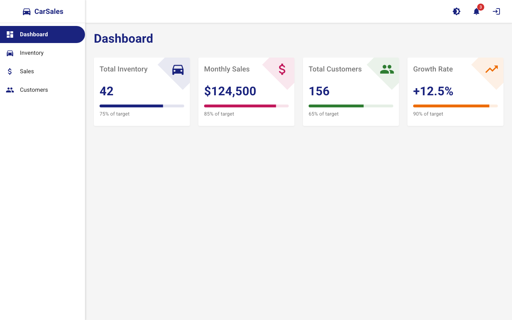 | [Car Sales Website](samples/spa/apps/car-sales-website/react/) | React + Vite | Build a dashboard-style code site with authentication, web roles, virtual tables, and Power Pages Web API integration. |
| 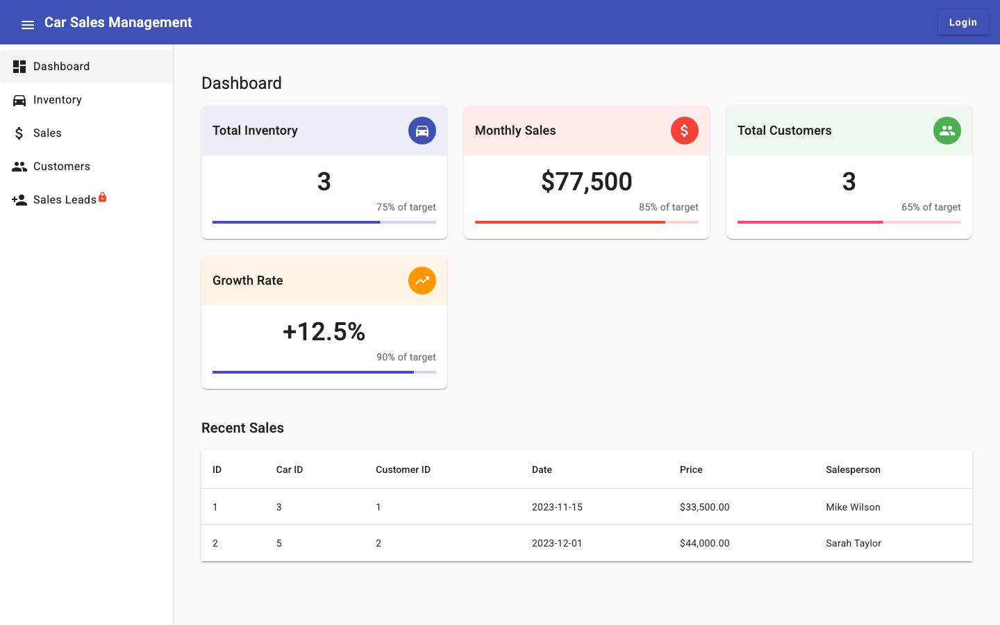 | [Car Sales Website](samples/spa/apps/car-sales-website/angular/) | Angular | Use Angular CLI to build and upload a Power Pages code site based on the car sales scenario. |
| 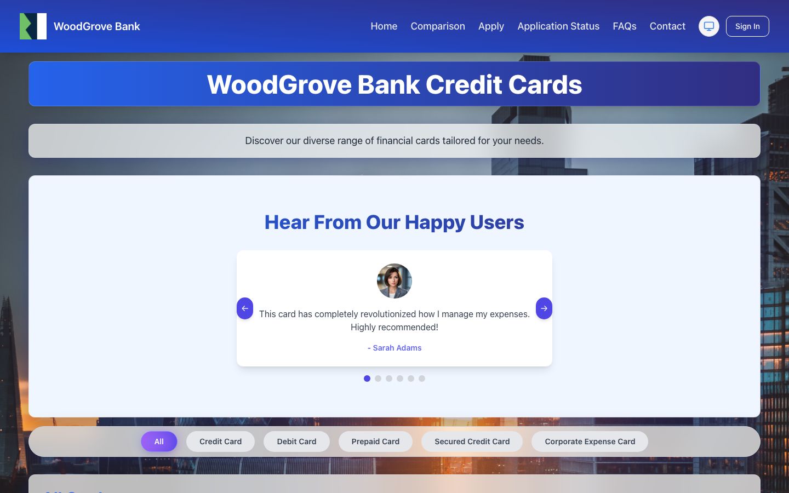 | [Credit Cards Website](samples/spa/apps/credit-cards-website/react/) | React + Vite | Create a customer-facing banking site with card browsing, applications, reviewer workflows, authentication, authorization, and Web API calls. |
| 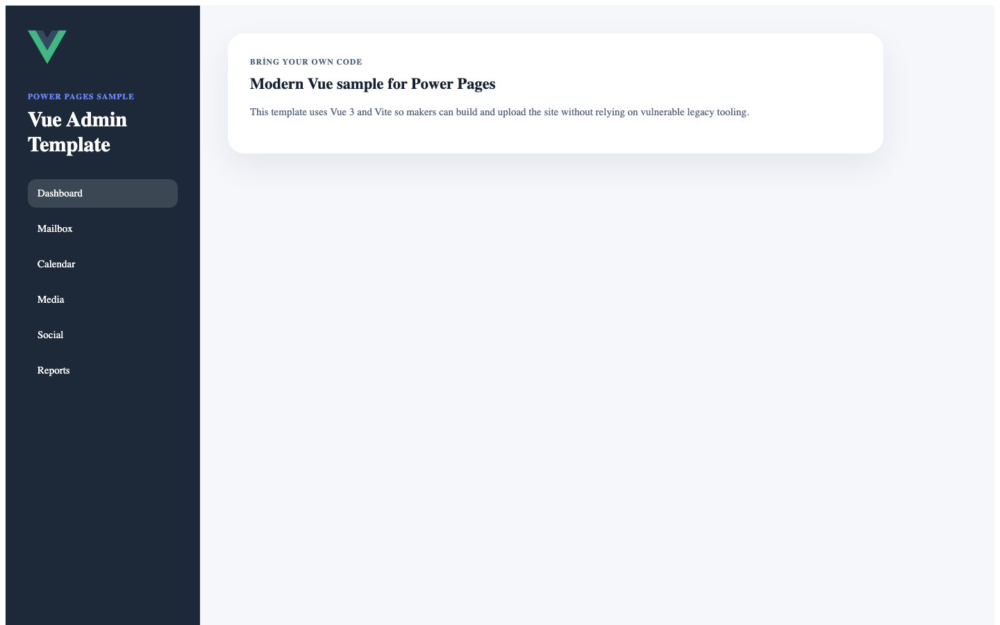 | [Vue Admin Template](samples/spa/apps/vue-admin-template/vue/) | Vue + Vite | Start from a Vue 3 admin-style template that can be uploaded as a Power Pages code site. |

### Single-topic snippets (`samples/spa/snippets/`)

| Preview | Sample | Framework | Use this sample to learn |
| --- | --- | --- | --- |
| 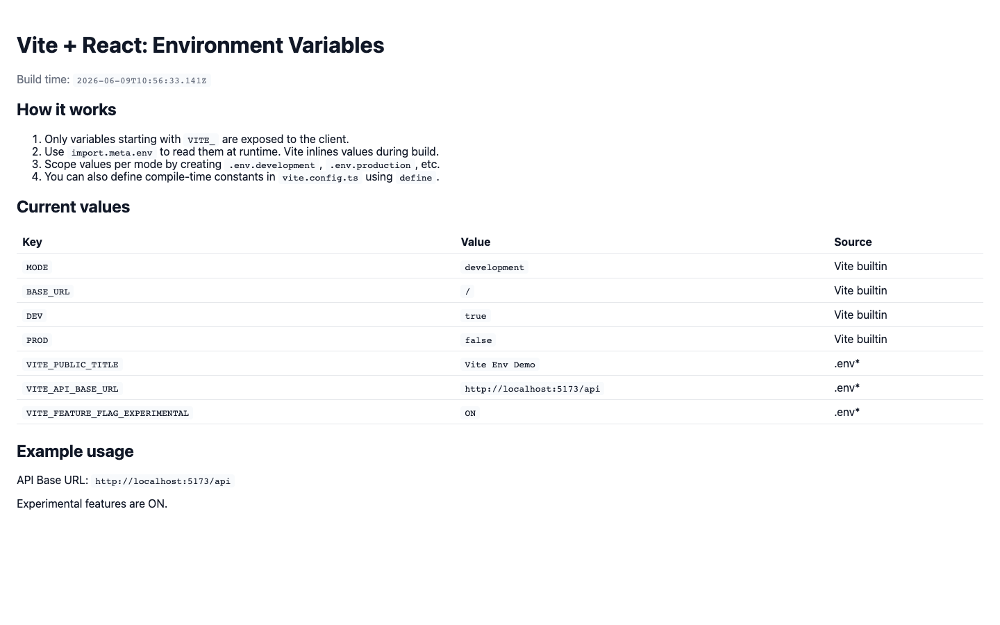 | [Environment Variables Demo](samples/spa/snippets/environment-variables/) | React + Vite | Understand how Vite exposes client-safe environment variables and compile-time constants. |
| 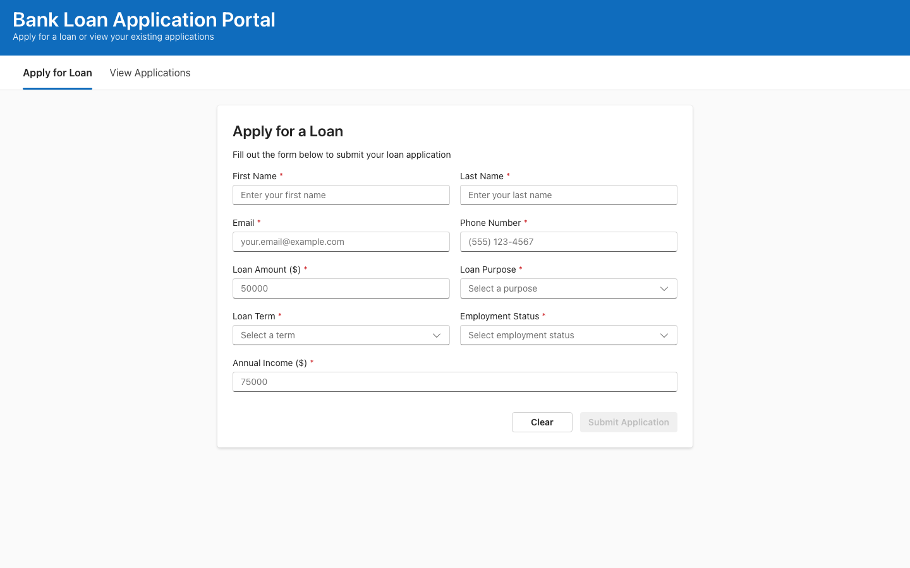 | [Fluent UI Bank Loan Application](samples/spa/snippets/fluent-ui/) | React + Fluent UI | Build a form-driven portal using Fluent UI v9 controls, state management, and a dashboard-style data grid. |
| 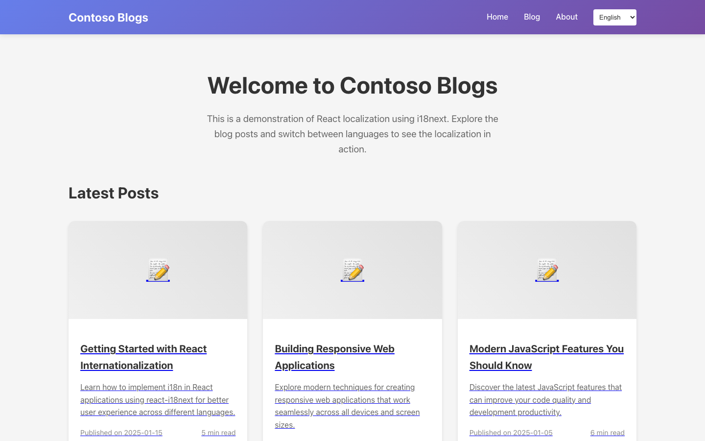 | [Localization Sample](samples/spa/snippets/localization/) | React + i18next | Add multilingual content, language switching, and localization patterns to a Power Pages code site. |
| 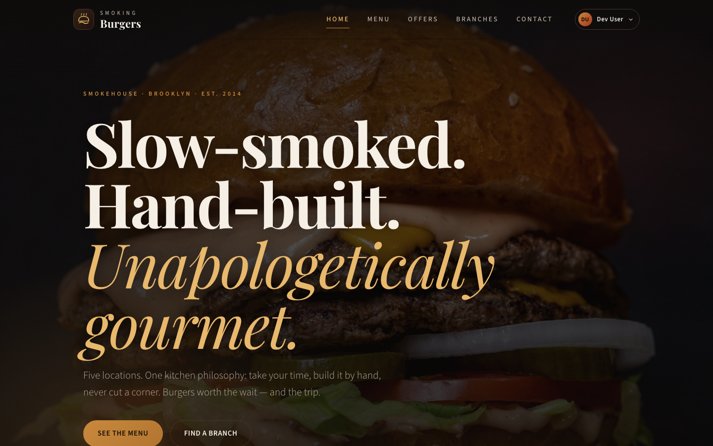 | [Authentication Sample](samples/spa/snippets/authentication/) | React + Vite | Explore local sign-in, registration, password reset, invitation redemption, external sign-in, terms acceptance, and role-protected content. |
| 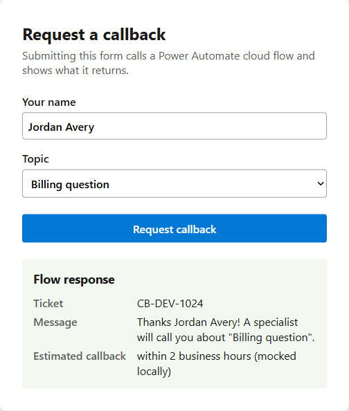 | [Cloud Flow Sample](samples/spa/snippets/cloud-flow/) | React + Vite | Invoke a registered Power Automate cloud flow from a code site with the CSRF token, and render its response. |
| 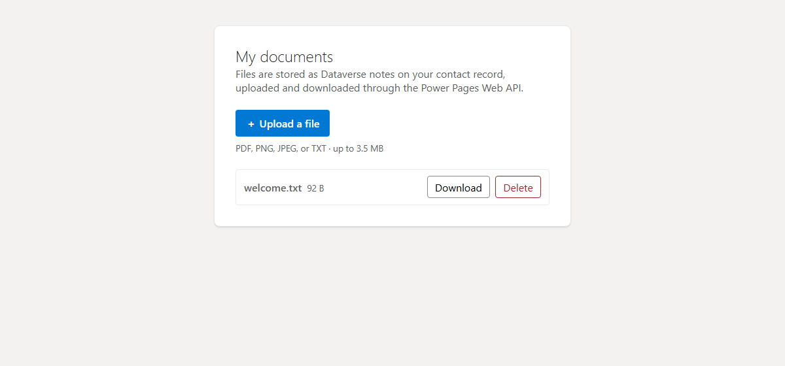 | [File Upload (Notes) Sample](samples/spa/snippets/file-upload/notes/) | React + Vite | Upload, list, download, and delete files via the Web API, stored as Dataverse notes (annotations). |
| 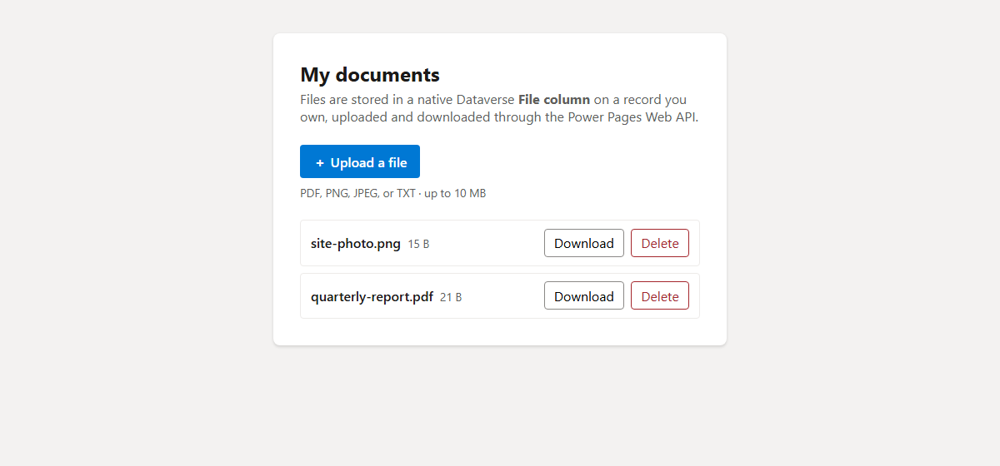 | [File Upload (File Column) Sample](samples/spa/snippets/file-upload/file-column/) | React + Vite | Upload, list, download, and delete files via the Web API, stored in a native Dataverse File column (binary, no base64). |
| 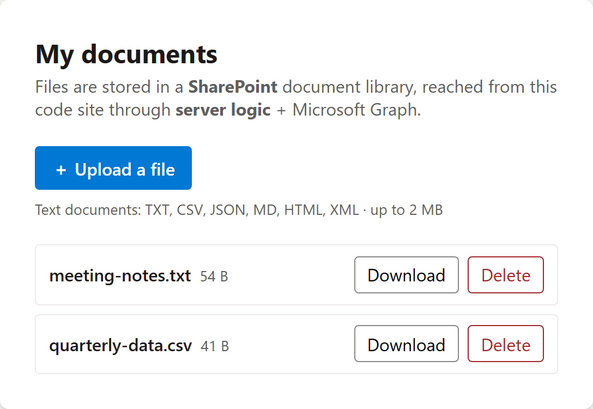 | [File Upload (SharePoint) Sample](samples/spa/snippets/file-upload/sharepoint/) | React + Vite | Upload, list, download, and delete files in a SharePoint document library, reached from a code site through server logic and Microsoft Graph. |
| 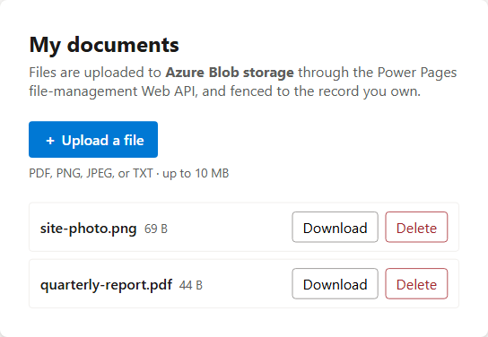 | [File Upload (Azure Blob) Sample](samples/spa/snippets/file-upload/azure-blob/) | React + Vite | Upload, list, download, and delete files via the Web API, stored in your own Azure Blob container (chunked uploads, up to 10 GB). |

### Traditional sites (`samples/traditional/`)

Non-code sites built with Liquid and web templates on the enhanced data model.

| Sample | Type | Use this sample to learn |
| --- | --- | --- |
| [EDM Liquid Web Template Starter](samples/traditional/edm-liquid-webtemplate-starter/) _(planned — placeholder)_ | Liquid + web template | Render Dataverse data on a traditional (non-code) site with a web template and Liquid on the enhanced data model. |

### Server logic (`samples/server-logic/`)

Server-side JavaScript that runs on the Power Pages runtime, callable from both code sites and traditional sites.

| Sample | Integrates | Use this sample to learn |
| --- | --- | --- |
| [SharePoint Integration](samples/server-logic/sharepoint-integration/) | Microsoft Graph + SharePoint | Call Microsoft Graph and SharePoint Online from server logic using an Entra client-credentials app. Pairs with the [File Upload (SharePoint)](samples/spa/snippets/file-upload/sharepoint/) code-site sample. |
| [Unbound Custom API Invocation](samples/server-logic/unbound-custom-api/) | Dataverse Custom APIs | Invoke an unbound Custom Action with `POST` and an unbound Custom Function with `GET` from server logic using a ready-to-import solution. |

## Sample categories

- [SPA Samples](samples/spa/) - code-site samples built with popular frontend frameworks and uploaded to Power Pages with the Power Platform CLI. Split into [full applications](samples/spa/apps/) and [single-topic snippets](samples/spa/snippets/).
- [Traditional Samples](samples/traditional/) - non-code sites built with Liquid and web templates on the enhanced data model.
- [Server Logic Samples](samples/server-logic/) - server-side JavaScript that runs on the Power Pages runtime.

## Resources

- [Get started with Power Pages tutorials](https://learn.microsoft.com/en-us/power-pages/getting-started/tutorial-overview)
- [Building websites with Power Pages - Online workshop](https://learn.microsoft.com/en-us/training/paths/power-pages-online-workshop/)
- [Power Platform developer docs](https://learn.microsoft.com/power-platform/developer)

## Contributing

See [CONTRIBUTING.md](CONTRIBUTING.md) for contribution guide.

## License

The code in this repo is licensed under the [MIT](LICENSE.txt) license.

---
Trademarks This project may contain trademarks or logos for projects, products, or services. Authorized use of Microsoft trademarks or logos is subject to and must follow Microsoft’s Trademark & Brand Guidelines. Use of Microsoft trademarks or logos in modified versions of this project must not cause confusion or imply Microsoft sponsorship. Any use of third-party trademarks or logos are subject to those third-party’s policies.
