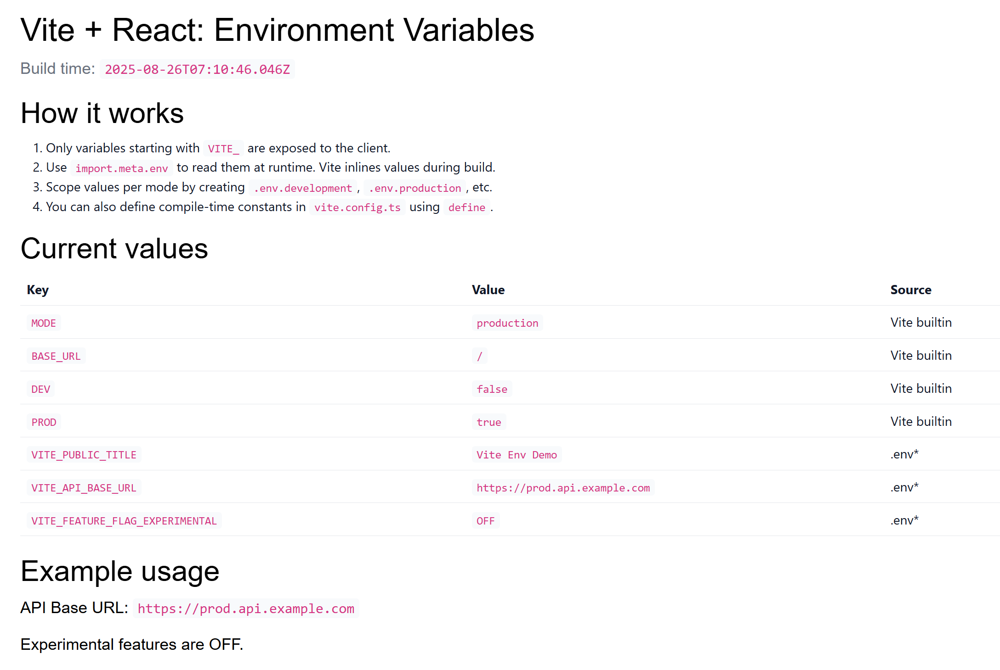

# Vite + React: Environment Variables Demo

This sample shows how to use environment variables in a Vite-powered React app.

Key points:

- Only variables prefixed with `VITE_` are exposed to the client.
- Access variables via `import.meta.env`.
- Use `.env`, `.env.development`, `.env.production` to scope values per mode.
- You can also define compile-time constants in `vite.config.ts` using `define`.

## Scripts

- `npm run dev` – Start dev server with `.env` and `.env.development`.
- `npm run build` – Build for production using `.env` and `.env.production`.
- `npm run preview` – Preview the built app locally.

## Try it

1. Install deps
2. Start dev server

You should see a table with current env values and an example usage section.

## Customizing

- Create a `.env.local` (ignored by git) for secrets on your machine.
- Add new public variables as `VITE_SOMETHING=value`.

## Running on Power Pages

Below steps will help you run this app in Power Pages.

### Setup

1. Install [Microsoft Power Platform CLI](https://learn.microsoft.com/power-platform/developer/cli/introduction?tabs=windows#install-microsoft-power-platform-cli). (Version should be >= 1.47.1)
1. Allow `*.js` files by removing it from `Blocked Attachments` in `Privacy + Security` settings for your environment from Power Pages Admin Center.
1. Open a terminal and cd into `vite-framework` folder.
1. Run `pac auth create --environment <Environment URL>` to login to your environment.

### Uploading site to Power Pages

1. Open a terminal and cd into `vite-framework` folder.
1. Run `npm run build` to build the code.
1. Run `pac pages upload-code-site --rootPath .` to upload the site to Power Pages.
1. Go to Power Pages home and click on **Inactive sites**.
1. You should see **Vite - React Env Vars Sample** site listed there. Click on **Reactivate** to proceed.
1. Once the site is activated, click on **Preview** to see it running on Power Pages.
1. Additionally, install [Power Platform Tools VS Code extension](https://aka.ms/power-platform-vscode) to easily upload the site in future iterations with a single click from within VS Code.
