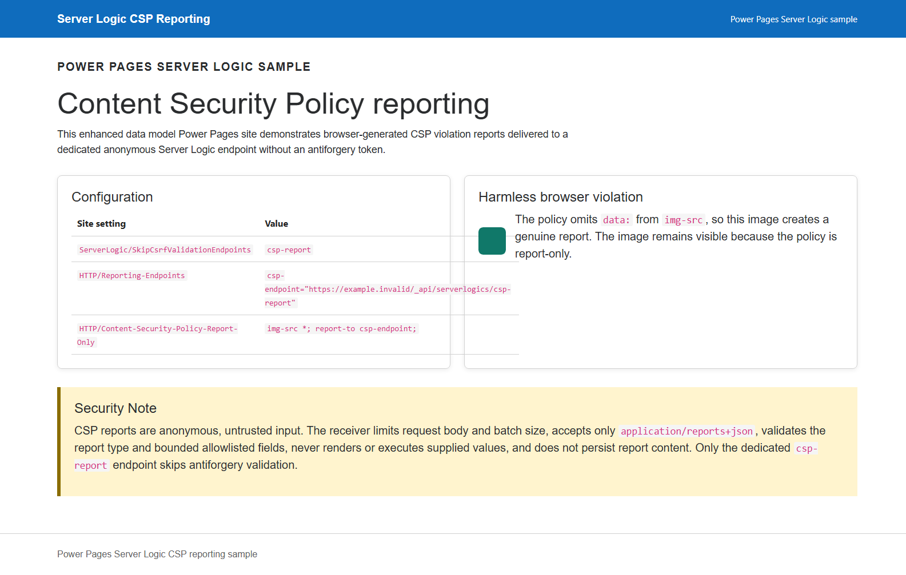

# Receive CSP violation reports with server logic

This sample shows how an enhanced data model Power Pages site can receive
browser-generated Content Security Policy (CSP) violation reports through a
dedicated Server Logic endpoint.

It uses:

- `ServerLogic/SkipCsrfValidationEndpoints`
- `HTTP/Reporting-Endpoints`
- `HTTP/Content-Security-Policy-Report-Only`

The importable unmanaged solution includes the complete site, home page,
anonymous and authenticated web roles, two Server Logic endpoints, and the
required site settings.



## Solution contents

| Component | Value |
| --- | --- |
| Solution | `ServerLogicCspReportingSample_1_0_0_0.zip` |
| Site | `Server Logic CSP Reporting` |
| Site type | Enhanced data model Power Pages site |
| CSP receiver | `POST /_api/serverlogics/csp-report` |
| Protected comparison endpoint | `POST /_api/serverlogics/protected-post` |
| Access | Both endpoints are assigned to the Anonymous Users and Authenticated Users roles |
| CSRF exception | Only `csp-report` |
| Persistence | None |

Solution ZIP SHA-256:
`4435EE60B4E86A73EB7C04816724A515A2C25A10DCE99D227D86A5E6A05EED90`.

## Prerequisites

- A Power Platform environment with Power Pages provisioned.
- Permission to import solutions and reactivate a Power Pages site.
- Power Pages runtime version `9.8.5` or later.

The CSP ingestion settings were introduced in the May 2026 runtime release
(`9.8.5`). The sample has also been validated on runtime `9.8.8.13`.

## Import and activate the sample

1. Download
   [`ServerLogicCspReportingSample_1_0_0_0.zip`](./ServerLogicCspReportingSample_1_0_0_0.zip).
2. In [Power Apps](https://make.powerapps.com), open the target environment,
   select **Solutions**, and import the ZIP file.
3. Open [Power Pages](https://make.powerpages.microsoft.com) in the same
   environment. Locate the imported **Server Logic CSP Reporting** site and
   reactivate it.
4. Choose an available site address when prompted.
5. In the site settings, replace `example.invalid` in
   `HTTP/Reporting-Endpoints` with the activated site's absolute HTTPS domain:

   ```text
   csp-endpoint="https://<your-site-domain>/_api/serverlogics/csp-report"
   ```

6. Publish the site, then restart it or clear its configuration cache.

The solution intentionally omits `<primarydomainname>` so an imported package
does not contain or overwrite a source environment hostname. Browsers require
an absolute HTTPS URL in `Reporting-Endpoints`; relative URLs are ignored.
Therefore, step 5 is required after Power Pages assigns the destination site's
address.

## Run the sample

Browse to the activated site's home page:

```text
https://<your-site-domain>/
```

The page loads a harmless green data-URI image. The report-only policy excludes
the `data:` scheme from `img-src`, causing a genuine `csp-violation` report
without blocking the image or breaking the page.

The response headers should include:

```http
Content-Security-Policy-Report-Only: img-src *; report-to csp-endpoint;
Reporting-Endpoints: csp-endpoint="https://<your-site-domain>/_api/serverlogics/csp-report"
```

Browsers batch Reporting API requests, so delivery may take approximately one
minute. The request is sent without an antiforgery token using
`Content-Type: application/reports+json`.

## Validate the security boundary

Run the following in the browser console from the sample site's home page.

The dedicated receiver accepts a valid tokenless report:

```javascript
const report = [{
  age: 0,
  type: "csp-violation",
  url: location.origin + "/",
  user_agent: navigator.userAgent,
  body: {
    blockedURL: "data",
    columnNumber: 1,
    disposition: "report",
    documentURL: location.origin + "/",
    effectiveDirective: "img-src",
    lineNumber: 1,
    originalPolicy: "img-src *; report-to csp-endpoint;",
    referrer: "",
    sample: "",
    sourceFile: location.origin + "/",
    statusCode: 200
  }
}];

await fetch("/_api/serverlogics/csp-report", {
  method: "POST",
  headers: { "Content-Type": "application/reports+json" },
  body: JSON.stringify(report)
});
```

Expected status: `200`.

The comparison endpoint remains protected:

```javascript
await fetch("/_api/serverlogics/protected-post", {
  method: "POST",
  headers: { "Content-Type": "application/json" },
  body: "{}"
});
```

Expected status without an antiforgery token: `401`.

Malformed JSON, an empty batch, the wrong content type, crafted directives, and
bodies larger than 32 KiB are rejected with status `400`.

## How the receiver handles untrusted input

The receiver:

- Accepts only `application/reports+json`.
- Limits the UTF-8 request body to 32 KiB.
- Limits a batch to 10 reports.
- Requires the Reporting API array envelope.
- Accepts only reports with type `csp-violation`.
- Validates bounded allowlisted CSP fields and numeric ranges.
- Does not execute, render, return, or persist report values.
- Logs only the number of accepted reports.

The sample deliberately throws a generic error for rejected input. The runtime
returns a generic `400` response without reflecting attacker-controlled values.

## Source files

- [`source/csp-report.sl`](./source/csp-report.sl) contains the defensive CSP
  receiver.
- [`source/protected-post.sl`](./source/protected-post.sl) is the normal POST
  endpoint used to prove that other Server Logic endpoints still require
  antiforgery validation.
- [`source/homepage-content.html`](./source/homepage-content.html) contains the
  sample page and harmless violation trigger.
- [`source/header.html`](./source/header.html) and
  [`source/footer.html`](./source/footer.html) keep the imported site
  self-contained.

## Security Note

Only add purpose-built machine-to-machine receivers to
`ServerLogic/SkipCsrfValidationEndpoints`. A skipped endpoint must not rely on a
signed-in browser session for authorization. Treat every report as anonymous,
untrusted input; enforce strict size and shape limits; avoid persistence unless
required; and never render or execute report values.

## Cleanup

Deactivate and delete the imported Power Pages site when it is no longer
needed. Because this is an unmanaged solution, deleting only the solution does
not automatically remove its components.

## Troubleshooting

- **No CSP report is delivered:** confirm that `Reporting-Endpoints` contains
  the activated site's absolute HTTPS URL. Relative URLs are not supported.
- **The headers have not changed:** publish the site, then restart it or clear
  its configuration cache.
- **The receiver returns 401:** confirm that
  `ServerLogic/SkipCsrfValidationEndpoints` contains exactly `csp-report`.
- **The receiver returns 400 for a browser report:** confirm the request uses
  `application/reports+json` and that the runtime is `9.8.5` or later.
- **Managed dependency error during import:** provision Power Pages in the
  target environment before importing the solution.
