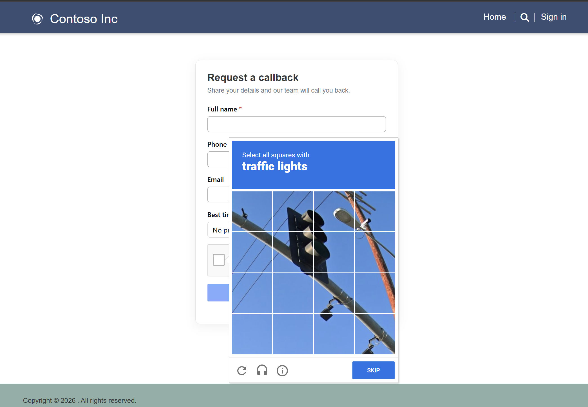

# How to: validate a custom form with a CAPTCHA using server logic

This guide walks you through setting up and testing the **server logic** sample
that adds a **CAPTCHA** to a **custom form** on a Power Pages site, verifies the
CAPTCHA token **server-side**, and only then writes the submission to a Dataverse
table.

The pattern is **CAPTCHA-provider agnostic** — you can plug in any provider
(hCaptcha, Cloudflare Turnstile, and so on) by rendering its widget on the page
and calling its verification endpoint from the server logic. **This sample uses
[Google reCAPTCHA](https://developers.google.com/recaptcha)** as a concrete
example.

> **Note:** Power Pages **basic forms** already offer a built-in CAPTCHA. This
> sample is for **custom forms** (hand-built HTML you POST yourself), where you
> bring your own CAPTCHA and validate it in server logic before saving data.

A custom "Request a callback" form collects a few fields and a CAPTCHA response.
On submit, a small client script sends the field values plus the CAPTCHA token to
a server logic. The server logic verifies the token with the CAPTCHA provider
and, **only if verification succeeds**, creates a **Callback Request** record in
Dataverse. This keeps the secret key off the client and guarantees the CAPTCHA is
actually checked before any data is stored.

## Scenario

> A public-facing portal has a lightweight "Request a callback" form. It is not a
> basic form (so there's no built-in CAPTCHA), and it is open to anonymous users,
> so it's an easy target for spam bots. Every submission must pass a CAPTCHA check
> that is verified on the server before a lead record is created.

## Step 1: Download the sample

1. Go to the sample folder:
   [samples/server-logic/custom-form-captcha](https://github.com/microsoft/power-pages-samples/tree/main/samples/server-logic/custom-form-captcha).
2. Select **Code > Download ZIP**, or clone the repository:

   ```bash
   git clone https://github.com/microsoft/power-pages-samples
   cd power-pages-samples/samples/server-logic/custom-form-captcha/
   ```

## Step 2: Prerequisites

Before you start, make sure you have:

* A Power Platform environment where you can import a Power Pages site.
* An account with your CAPTCHA provider. For the Google reCAPTCHA example, use the
  [reCAPTCHA admin console](https://www.google.com/recaptcha/admin).

## Step 3: Register your CAPTCHA site (get your keys)

Register your site with your CAPTCHA provider to obtain a **site key** (public,
rendered into the page) and a **secret key** (private, used only by the server
logic).

For the Google reCAPTCHA example:

1. Open the [reCAPTCHA admin console](https://www.google.com/recaptcha/admin) and
   select **+** (Create).
2. Give it a **Label**, choose **reCAPTCHA v2 → "I'm not a robot" Checkbox**, and
   add your site's **domain** (for example, `contoso.powerappsportals.com`). Do
   not include `https://` or a path. For local testing you can also add
   `localhost`.
3. Submit to get your **site key** and **secret key**.

## Step 4: Import the site and set the environment variables

1. Import the downloaded site into your target environment. Follow
   [Import a Power Pages site solution](https://learn.microsoft.com/power-pages/configure/power-pages-solutions#import-the-solution-into-the-target-environment).
   The solution includes the **Callback Request** table, the custom form page, the
   server logic, and the table permissions — so there's nothing to wire up by
   hand.
2. During import you'll be asked to provide values for these **environment
   variables**. Enter the keys from Step 3:

   | Environment variable  | Value                         |
   | --------------------- | ----------------------------- |
   | `RecaptchaSiteKey`    | Your CAPTCHA **site key**     |
   | `RecaptchaSecretKey`  | Your CAPTCHA **secret key**   |

### Script Highlight: Configuration Section

The server logic reads the secret from the environment (never exposed to the
browser), and the page renders the site key with Liquid — so no keys are stored
in code:

```javascript
const RECAPTCHA_SECRET = Server.SiteSetting.Get("RecaptchaSecretKey");
const VERIFY_URL = "https://www.google.com/recaptcha/api/siteverify";
const ENTITY_SET_NAME = "sample_callbackrequests"; // plural logical name of the table
```

```html
<div class="g-recaptcha"
     data-sitekey="{{ settings['RecaptchaSiteKey'] }}"
     data-callback="captchaCompleted"
     data-expired-callback="captchaExpired">
</div>
```

## Step 5: Activate the site

Open the site in the Power Pages design studio and **activate** (provision) it so
it becomes available at its portal URL.

### Script Highlight: Verify First, Then Create

The security guarantee of this sample is ordering: the record is created **only**
after the CAPTCHA provider confirms the token is valid.

```javascript
const result = JSON.parse(response.Body);
if (!result.success) {
    // CAPTCHA failed — do NOT create a record
    return JSON.stringify({ status: "error", success: false, message: "CAPTCHA verification failed. Please try again." });
}

// CAPTCHA passed — safe to create the record
const createResultRaw = await Server.Connector.Dataverse.CreateRecord(ENTITY_SET_NAME, JSON.stringify(record));
```

## Step 6: Test

The custom **Request a callback** form presents the CAPTCHA challenge before the
submission is accepted:



1. Browse to the **Request a callback** page.
2. The **Submit** button stays disabled until you solve the CAPTCHA.
3. Fill in **Full name** and **Phone number** (Email and Best time to call are
   optional), solve the CAPTCHA, and select **Submit request**.
4. On success, the form is replaced by a **Thank you** confirmation, and a new
   **Callback Request** row appears in Dataverse.
5. To see failure handling, let the CAPTCHA expire (wait, or use the widget's
   reset) and submit — the client blocks the request and prompts you to complete
   the CAPTCHA again.
