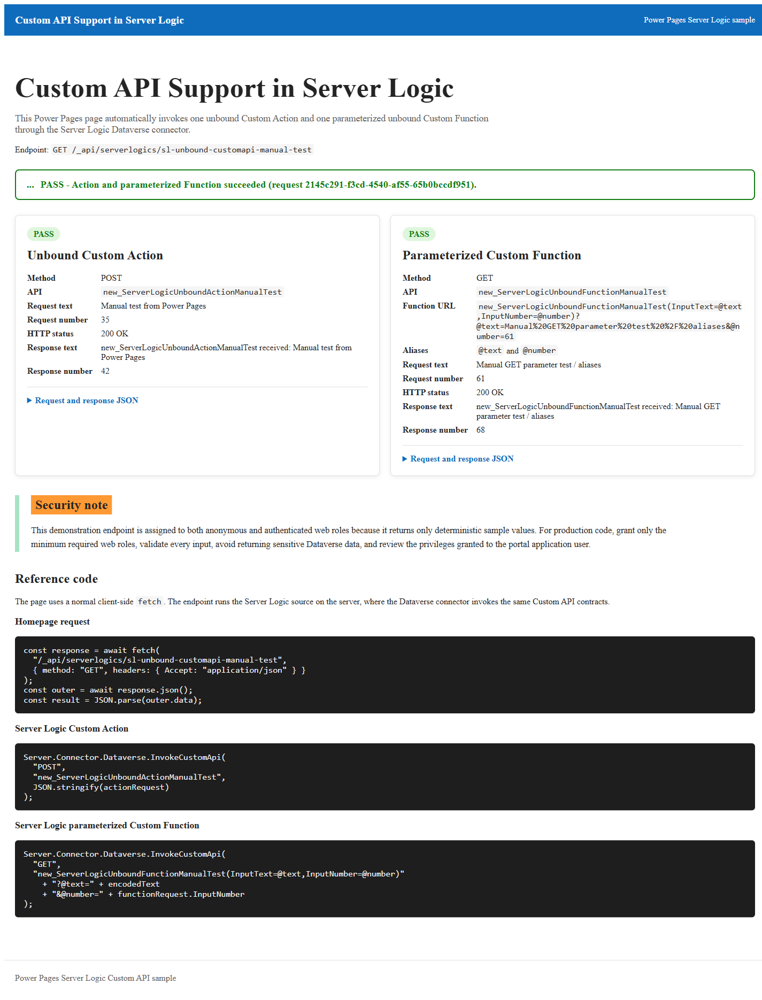
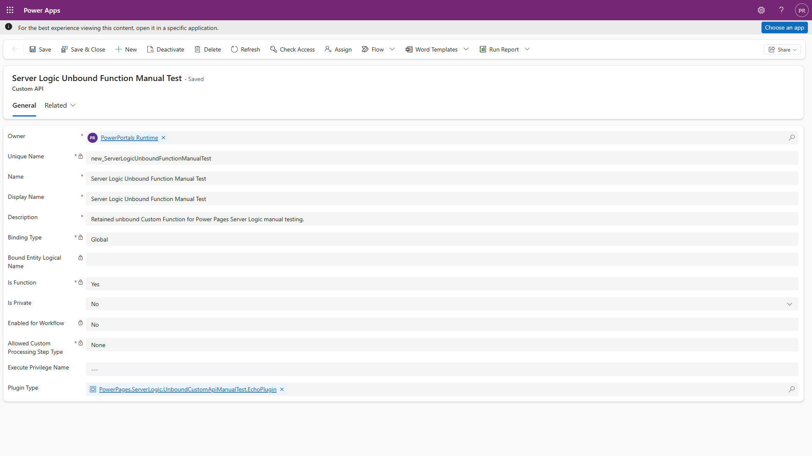
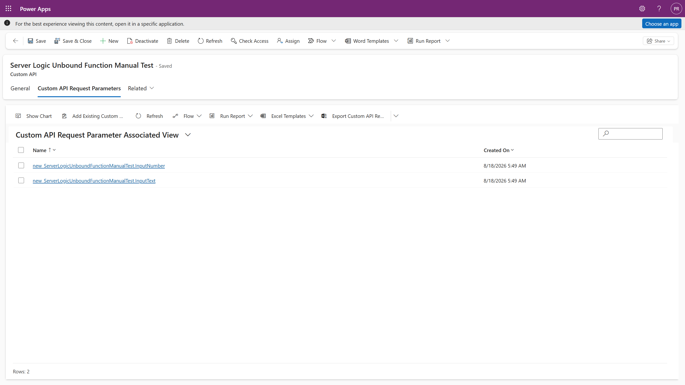

# Invoke unbound Dataverse Custom APIs from server logic

This sample shows how Power Pages server logic can invoke both forms of an
unbound Dataverse Custom API:

- A **Custom Action** by using `POST` with request parameters.
- A **Custom Function** by using `GET` with OData parameter aliases and no
  request body.

The importable unmanaged solution includes an enhanced-data-model Power Pages
site, its ready-to-run home page, server logic, two Custom APIs, their
parameters and response properties, and a compiled, signed Dataverse plug-in.
No code compilation, page editing, or plug-in registration is required after
import.



## Solution contents

| Component | Value |
| --- | --- |
| Solution | `ServerLogicUnboundCustomApiSample_1_0_0_2.zip` |
| Site | `Custom API Support in Server Logic` |
| Site type | Enhanced-data-model site (not a code site) |
| Home page | Automatically invokes the server logic endpoint and renders both results |
| Server logic endpoint | `sl-unbound-customapi-manual-test` |
| Custom Action | `new_ServerLogicUnboundActionManualTest` |
| Custom Function | `new_ServerLogicUnboundFunctionManualTest` |
| Action inputs | `InputText` (String), `InputNumber` (Integer) |
| Function inputs | `InputText` (String), `InputNumber` (Integer) |
| Action and function outputs | `ResponseText` (String), `ResponseNumber` (Integer) |
| Access | Anonymous Users and Authenticated Users web roles |

## Prerequisites

- A Power Platform environment with Power Pages provisioned.
- Permission to import solutions and reactivate a Power Pages site.
- Power Pages runtime version `9.8.9.xx` or later for unbound Custom Function
  calls through `InvokeCustomApi`.
- The standard Power Pages managed solutions. The package declares these
  dependencies:
  - `PowerPages_CoreBase` version `1.1.2605.1` or later.
  - `Basic` version `1.0`.

## Import and activate the sample

1. Download
   [`ServerLogicUnboundCustomApiSample_1_0_0_2.zip`](./ServerLogicUnboundCustomApiSample_1_0_0_2.zip).
2. In [Power Apps](https://make.powerapps.com), open the target environment,
   select **Solutions**, and import the ZIP file.
3. Open [Power Pages](https://make.powerpages.microsoft.com) in the same
   environment. Locate the imported **Custom API Support in Server Logic**
   site and reactivate it.
4. Choose an available site address when prompted.
5. Publish all customizations and wait for the site to finish provisioning.

Site reactivation is required after the first import because a Power Pages site
address cannot be provisioned by a portable solution package. The package
intentionally omits a primary domain so importing a newer sample version does
not replace the address of an already activated site.

## Run the sample

Browse to the activated site's home page:

```text
https://<your-site-domain>/
```

The page automatically calls:

```text
GET /_api/serverlogics/sl-unbound-customapi-manual-test
```

It displays the action and function request values, HTTP statuses, response
values, pass/fail badges, and the reference code used by the sample. You can
also browse directly to the endpoint URL to inspect its raw JSON response.

The endpoint returns a wrapper whose `data` property is a JSON string. A
successful response has this shape:

```json
{
  "success": true,
  "serverLogicName": "sl-unbound-customapi-manual-test",
  "data": "{\"overallPass\":true,...}"
}
```

After parsing `data`, both calls report the expected values:

```json
{
  "overallPass": true,
  "action": {
    "method": "POST",
    "response": {
      "statusCode": 200,
      "body": {
        "ResponseNumber": 42
      }
    },
    "passed": true
  },
  "function": {
    "method": "GET",
    "request": {
      "InputText": "Manual GET parameter test / aliases",
      "InputNumber": 61
    },
    "response": {
      "statusCode": 200,
      "body": {
        "ResponseNumber": 68
      }
    },
    "passed": true
  }
}
```

## How it works

The dedicated home Web Template renders the page content and embeds the
client-side script, so the sample does not depend on JavaScript hooks from a
starter site's Header or Footer. The script uses a normal same-origin request
and parses the Server Logic response:

```javascript
const response = await fetch(
    "/_api/serverlogics/sl-unbound-customapi-manual-test",
    {
        method: "GET",
        credentials: "same-origin",
        headers: { Accept: "application/json" }
    }
);
const outer = await response.json();
const result = JSON.parse(outer.data);
```

The server logic sends a body with the unbound action:

```javascript
var actionRequest = {
    InputText: "Manual test from Power Pages",
    InputNumber: 35
};

var actionResponse = Server.Connector.Dataverse.InvokeCustomApi(
    "POST",
    "new_ServerLogicUnboundActionManualTest",
    JSON.stringify(actionRequest)
);
```

The unbound function uses `GET` and puts its input values in OData parameter
aliases. The binding list stays in the operation path, while the encoded values
stay in the query string:

```javascript
function encodeODataStringAlias(value) {
    return encodeURIComponent("'" + value.replace(/'/g, "''") + "'");
}

var functionRequest = {
    InputText: "Manual GET parameter test / aliases",
    InputNumber: 61
};
var functionUrl =
    "new_ServerLogicUnboundFunctionManualTest(InputText=@text,InputNumber=@number)"
    + "?@text=" + encodeODataStringAlias(functionRequest.InputText)
    + "&@number=" + functionRequest.InputNumber;

var functionResponse = Server.Connector.Dataverse.InvokeCustomApi(
    "GET",
    functionUrl
);
```

The plug-in echoes each input text and adds `7` to `InputNumber`. The action
therefore returns `42`, while the function returns `68`. The server logic parses
the connector response and sets `overallPass` only when both calls return the
expected values.

## Imported Custom API configuration

The action is global (`Binding Type = Global`) and is not a function:


The function is also global and has `Is Function = Yes`:



Its two inputs are configured as Custom API request parameters:



## Source files

- [`source/homepage-content.html`](./source/homepage-content.html) contains the
  page markup and styles included in the solution.
- [`source/homepage.js`](./source/homepage.js) invokes the Server Logic endpoint
  and renders the action and function results. The dedicated home Web Template
  in the solution embeds this script after the editable page content.
- [`source/header.html`](./source/header.html) and
  [`source/footer.html`](./source/footer.html) keep the imported site
  self-contained and free of starter-template snippet dependencies.
- [`source/sl-unbound-customapi-manual-test.sl`](./source/sl-unbound-customapi-manual-test.sl)
  contains the server logic included in the solution.
- [`source/EchoPlugin.cs`](./source/EchoPlugin.cs) contains the equivalent
  Dataverse plug-in source. The solution already contains the compiled, signed
  assembly; the source is included for learning and review.

## Security note

This demonstration endpoint is assigned to both anonymous and authenticated
web roles because it returns only deterministic sample values. For production
code, grant only the minimum required web roles, validate every input, avoid
returning sensitive Dataverse data, and review the privileges granted to the
portal application user.

## Troubleshooting

- **404 from the server logic URL:** confirm that the imported site is active,
  the endpoint name is unchanged, and customizations are published.
- **The home page stays on "Running":** publish all customizations and confirm
  that the imported Home Web Template is still assigned to the Home Page
  Template.
- **The browser sends two requests to the server logic endpoint:** import
  version `1.0.0.2` or later, publish all customizations, and clear the site's
  configuration cache. This version removes legacy page JavaScript and also
  prevents duplicate initialization.
- **Custom API not found:** confirm the two Custom APIs and the plug-in assembly
  were imported successfully, then publish all customizations.
- **The action succeeds but the function reports HTTP 400:** the target
  environment has not yet received Power Pages runtime version `9.8.9.xx` or
  later. Parameterized unbound Custom Functions through `InvokeCustomApi` are
  available starting with `9.8.9.xx`.
- **Managed dependency error during import:** provision Power Pages in the
  target environment so the required Power Pages core solutions are installed.
