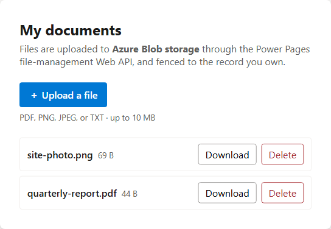

# File Upload to Azure Blob Storage Sample (React + Vite)

This sample shows how to **upload, list, download, and delete files with the
Power Pages Web API**, storing the file bytes in **Azure Blob storage** instead
of in Dataverse. It uses the dedicated file-management Web API
(`/_api/file/...`) — a different API from the notes and file-column samples.

The entire lesson is in [`src/blobFileService.ts`](src/blobFileService.ts) — the
rest of the app is just UI around it. Settings are config-driven in
[`src/config.ts`](src/config.ts).

> **How the three file-storage samples differ.** All three are sibling samples
> under [`file-upload/`](../):
>
> | Sample | Where the bytes live | API | Custom table? |
> |---|---|---|---|
> | [notes](../notes) | Dataverse (annotation `documentbody`, base64) | `/_api/annotations` | No |
> | [file-column](../file-column) | Dataverse file storage | `/_api/<table>(<id>)/<filecolumn>` | Yes |
> | **azure-blob** (this) | **Your Azure Blob container** | **`/_api/file/...`** | **No** |
>
> Azure Blob is the right choice for **large files** (up to 10 GB) and for
> keeping bulky binaries out of Dataverse capacity. Like the notes sample, it
> needs **no custom table** — each file is attached to the signed-in user's
> contact and tracked by a small annotation placeholder.

## What this teaches

- The **initialize-then-stream** upload the blob API uses:
  `POST /_api/file/InitializeUpload/...` to get an upload token, then a loop of
  `PUT /_api/file/UploadBlock/...` blocks. **There is no commit call** — the
  upload finalizes when the last block reaches `fileSize` (a deliberate contrast
  with the file-column `CommitFileBlocksUpload` step).
- First-class **chunking** with a progress bar (a single chunk can be up to
  100 MB; total up to 10 GB — no 16 MB single-call ceiling like file columns).
- Listing blob files by querying the **`.azure.txt` annotation placeholders**
  attached to the user's contact.
- Downloading via `/_api/file/download/...` (the portal streams the real blob,
  by default through a short-lived SAS URI).
- Deleting via `DELETE /_api/file/delete/...`.
- Sending the CSRF token on every write, and guarding file size and type.

## Screenshot



## How it works (the Web API calls)

Attaching each file to the signed-in user's contact:

```
Upload   POST /_api/file/InitializeUpload/contact(<contactId>)/blob     -> upload token
         PUT  /_api/file/UploadBlock/blob?offset=&fileSize=&chunkSize=&token=   (per block; no commit)
List     GET  /_api/annotations?$select=...&$filter=_objectid_value eq <contactId> and endswith(filename,'.azure.txt')
Download GET  /_api/file/download/annotation(<annotationId>)/blob/$value
Delete   DELETE /_api/file/delete/annotation(<annotationId>)/blob/$value
```

- **Initialize** sends `x-ms-file-name` and `x-ms-file-size` headers and returns
  an opaque upload token used by every `UploadBlock` call. It also needs the
  anti-forgery token as a **form field** in the request body (not just the
  header) — the file-management endpoints use the classic ASP.NET anti-forgery
  validator, which only reads the token from a form field.
- **UploadBlock** streams raw bytes (`application/octet-stream`) for one slice;
  `offset`/`fileSize`/`chunkSize`/`token` are query-string parameters.
- **List** finds the placeholder notes the API created (their file name ends in
  `.azure.txt`); the sample strips that suffix and reads the real name/type/size
  from the placeholder's JSON body when available.
- **Download** opens the portal download endpoint, which streams the real blob
  with the stored file name.

## Key points

- Each file is attached to the user's contact, so the contact id from
  `window.Microsoft.Dynamic365.Portal.User.contactId` is required — the user
  must be signed in.
- Writes (`POST`, `PUT`, `DELETE`) require the `__RequestVerificationToken`.
  Most send it as a header; `InitializeUpload` additionally requires it as a
  urlencoded **form field** in the body (see above). Reads (`GET`) need neither.
- Running locally (`npm run dev`) uses an in-memory mock that simulates the
  chunked upload (so the progress bar works) and holds the raw bytes, so you can
  exercise the whole UI offline.

## Required Azure setup

This is the part the sample **cannot** provision for you — it must exist before
the live calls work:

1. Create an **Azure Storage account** (Resource Manager model) and a **blob
   container** inside it.
2. Find the portal's Enterprise application in Microsoft Entra ID — it is named
   **`Portals-<your site name>`** — and grant it **two** role assignments:
   - **Reader** on the **resource group** that contains the storage account.
   - **Storage Blob Data Contributor** on the **storage account**.

   (A missing or wrong role assignment surfaces as error `FU00018`.)

See [Use the Web API to upload files to Azure Blob storage](https://learn.microsoft.com/power-pages/configure/webapi-azure-blob).

## Required configuration

The site needs **all** of the following. This sample ships them under
`.powerpages-site/`, but several are easy to get subtly wrong:

1. **File-management Web API enabled and pointed at your storage.** These are the
   `Site/FileManagement/*` settings — **not** the `FileStorage/CloudStorageAccount`
   keys (those configure the unrelated forms/timeline attachment path). Shipped
   site settings (replace the two placeholder values with your own):
   - `Site/FileManagement/EnableWebAPI = true`
   - `Site/FileManagement/BlobStorageAccountName = your-storage-account-name`
   - `Site/FileManagement/BlobStorageContainerName = your-container-name`
   - `Site/FileManagement/SupportedFileType = .pdf,.png,.jpg,.jpeg,.txt`
   - `Site/FileManagement/SupportedMimeType = application/pdf;image/png;image/jpeg;text/plain`
   - `Site/FileManagement/MaxFileSize = 10240` (KB)
2. **Web API enabled for the annotation table** so the SPA can list the
   placeholder notes:
   - `Webapi/annotation/enabled = true`, `Webapi/annotation/fields = *`
   - (`Webapi/contact/*` is shipped too, for parity with the notes sample.)
3. **Table permissions**, each **assigned to the Authenticated Users web role**
   (the web-role binding is required — a permission with no web role grants nothing):
   - **Contact (Self)** — `contact`, **Self** scope, with **Read + Append + Append To**.
   - **Notes on contact** — `annotation`, **Parent** scope (`756150003`), with
     **Create / Read / Write / Delete / Append / Append To**, its
     `parententitypermission` pointing at the Contact (Self) permission, **and its
     `parentrelationship` set to `Contact_Annotation`**.

> ⚠️ **Two things that are easy to miss (hard-won from the notes sample, and they
> apply here unchanged because blob files ARE annotations):**
>
> 1. The web-role binding field in the `.tablepermission.yml` must be
>    **`adx_entitypermission_webrole`**. The unprefixed `entitypermission_webrole`
>    is **silently dropped on deploy**, leaving the permission bound to no role.
> 2. A **Parent**-scoped permission must set **`parentrelationship`**
>    (`Contact_Annotation` here). Omit it and every read fails with a CDS/500
>    error while creates still succeed — the confusing "uploads work but nothing
>    shows up" symptom.

4. **Authentication** so visitors have a contact record — see [Sign-in is required](#sign-in-is-required).

## Sign-in is required

Every operation runs as the **signed-in user's contact** — files are attached
to, and fenced to, that contact (with the secure `Self`/`Parent` scopes above,
each user only ever sees their own files). So:

- Anonymous visitors have no `contactId`; the app shows a **Sign in** button (→ `/SignIn`).
- ⚠️ **Testing gotcha:** previewing a brand-new **trial** site *as its owner* gives a
  **contactless "previewer" session** — `contactId` is empty and uploads won't work even
  though you appear signed in. Sign in as a real authenticated user instead. On a trial
  site, enabling that can require **making the site public, which means converting the
  trial site to production**. This is only a *validation* note — it is **not** a
  requirement of the feature: on a normal production site an authenticated sign-in
  creates the contact automatically.

## Validated live

This sample was validated end-to-end against a live Enhanced Data Model site
(upload → list → download → delete, signed in as an authenticated user). A few
real-world specifics were confirmed, and one surprise was fixed in the code:

- **`InitializeUpload` needs the anti-forgery token as a form field, not (only) a
  header.** Sending it solely as the `__RequestVerificationToken` header returns
  HTTP 500 (`The required anti-forgery form field ... is not present`) — the
  file-management endpoints use the classic ASP.NET anti-forgery validator, which
  reads a form field. This sample sends it both ways (see the note in
  [`blobFileService.ts`](src/blobFileService.ts) and [Troubleshooting](#troubleshooting)).
  Note this contradicts the official MS Learn sample, which uses a header.
- The final `UploadBlock` finalizes the file with **no commit call**.
- Listing by the **`.azure.txt`** placeholder suffix works, and the real
  name/type/size come from the placeholder's JSON `documentbody`.
- The annotation **Parent** scope + **`Contact_Annotation`** relationship is
  sufficient for blob placeholders — Global access (as the Microsoft sample uses)
  is **not** required.
- Only the **`Site/FileManagement/*`** settings are needed — the unrelated
  `FileStorage/CloudStorageAccount` keys are **not** required.

The error-code table (`FU00001`–`FU00022`) in the official docs is the reference
for storage/permission errors.

## Troubleshooting

| Symptom | Cause / fix |
|---|---|
| **`InitializeUpload failed (status 500)`**, and the server detail mentions *"anti-forgery form field `__RequestVerificationToken` is not present"* | The file-management endpoints validate the CSRF token as a **form field**, not the header the rest of the Web API uses. This sample already sends it as a urlencoded body field on `InitializeUpload`; if you adapt the code, keep that. |
| **Uploaded code changes don't show up** — the site still serves the old JS bundle after `pac pages upload-code-site` (the `no-store` `index.html` still references the previous hashed bundle, and the new bundle 404s) | The runtime serves a cached copy. **Purge the cache**: Power Platform admin center → **Manage** → **Power Pages** → your site → **More portal actions** → **Purge Cache** (takes a few minutes). |
| **`FU00018`** on upload | The `Portals-<site>` Enterprise app is missing a role assignment — grant **Storage Blob Data Contributor** on the storage account and **Reader** on its resource group (see [Required Azure setup](#required-azure-setup)). |
| **Uploads succeed but no files appear in the list** | The **Notes on contact** permission is missing its **`parentrelationship: Contact_Annotation`**, or a table permission isn't bound to the **Authenticated Users** web role (see [Required configuration](#required-configuration)). |
| **`contactId` is empty / "You must be signed in"** even though you appear signed in | A contactless owner-**preview** session on a trial site. Sign in as a real authenticated user — see [Sign-in is required](#sign-in-is-required). |

## Scripts

- `npm run dev` – Start the local dev server (uses the in-memory mock store).
- `npm run build` – Type-check and build for production into `dist/`.
- `npm run preview` – Preview the production build locally.

## Running on Power Pages

### Setup

1. Install [Microsoft Power Platform CLI](https://learn.microsoft.com/power-platform/developer/cli/introduction?tabs=windows#install-microsoft-power-platform-cli) (version >= 1.47.1).
1. Complete the [Required Azure setup](#required-azure-setup) (storage account,
   container, and the two role assignments to the `Portals-<site>` app).
1. Edit the two placeholder site settings (`BlobStorageAccountName`,
   `BlobStorageContainerName`) under `.powerpages-site/site-settings/` to point at
   your account and container.
1. Allow `*.js` files by removing it from **Blocked Attachments** in **Privacy + Security** settings for your environment in the Power Pages Admin Center.
1. Open a terminal and `cd` into this `azure-blob` folder.
1. Run `pac auth create --environment <Environment URL>` to log in to your environment.

### Uploading the site

1. Run `npm install` then `npm run build`.
1. Run `pac pages upload-code-site --rootPath .` to upload the site.
1. **Re-deploying an existing site?** Power Pages caches the compiled bundle, so a
   fresh `upload-code-site` can keep serving the old code. After re-uploading,
   **Purge Cache** (Power Platform admin center → **Manage** → **Power Pages** →
   your site → **More portal actions** → **Purge Cache**) — see
   [Troubleshooting](#troubleshooting).
1. Go to Power Pages home and click **Inactive sites**. Find
   **File Upload (Azure Blob) Sample** and click **Reactivate**.
1. Configure authentication and confirm the site settings and table permissions
   above are present (including the `Site/FileManagement/*` values pointing at
   your storage, and the `parentrelationship` on the Notes on contact permission).
1. Click **Preview** and **sign in as an authenticated user** — see
   [Sign-in is required](#sign-in-is-required); the owner-preview session on a trial
   site is contactless — then upload a file and download/delete it.
