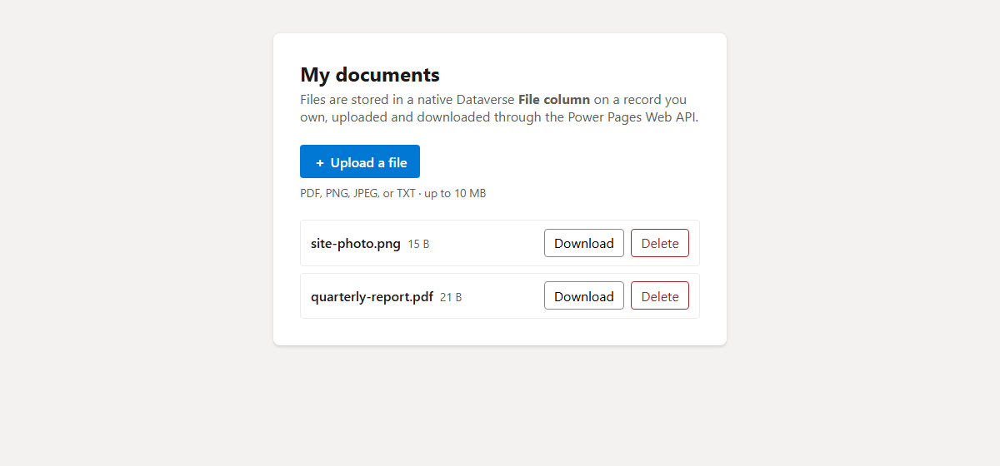

# File Upload to a Dataverse File Column Sample (React + Vite)

This sample shows how to **upload, list, download, and delete files with the
Power Pages Web API**, storing each file in a **native Dataverse File column**
on a custom table — the modern alternative to the notes/annotation approach.

The entire lesson is in [`src/fileColumnService.ts`](src/fileColumnService.ts) —
the rest of the app is just UI around it. The table and column names are
config-driven in [`src/config.ts`](src/config.ts) so you can point it at your
own table.

> **Notes vs File column.** The sibling
> [the notes sample](../notes) stores files as Dataverse **notes
> (annotations)** — base64 in `documentbody`, no schema work, best for many small
> attachments on an existing record. This sample stores files in a native
> **File column** — raw binary (no base64 inflation), a larger practical size,
> and a strongly-typed per-record file. It requires a custom table.

## What this teaches

- The **two-step create** that file columns require: `POST` the record first,
  then `PATCH` the raw bytes into the File column (you cannot upload bytes to a
  record that doesn't exist yet).
- Uploading raw binary (`application/octet-stream` from `file.arrayBuffer()`) —
  **no base64**.
- Downloading via the File column's `$value` endpoint and wrapping the bytes in
  a typed `Blob`.
- Listing a user's files with `$select`/`$filter`/`$orderby`.
- Deleting with `DELETE /_api/<set>(<id>)`.
- Sending the CSRF token on every write, and guarding file size and type.

## Screenshot



## How it works (the Web API calls)

With entity set `sample_filerecords` and File column `sample_file`:

```
Upload   POST  /_api/sample_filerecords                       (create the record)
         PATCH /_api/sample_filerecords(<id>)/sample_file      (raw bytes → File column)
List     GET   /_api/sample_filerecords?$select=...&$filter=_sample_contact_value eq <contactId>&$orderby=createdon desc
Download GET   /_api/sample_filerecords(<id>)/sample_file/$value   (raw bytes back)
Delete   DELETE /_api/sample_filerecords(<id>)                  (removes record + file)
```

- **Create** captures the new record id from the `OData-EntityId` response header.
- **Upload** sends the file name via the `x-ms-file-name` header so Dataverse
  stores the correct file name in the File column.
- **Download** reads the original name and MIME type from companion columns
  (`sample_filename` / `sample_mimetype`) — we don't depend on portal response
  headers — then names and types the downloaded Blob.

## Key points

- Each file record is bound to the user's contact via
  `sample_contact@odata.bind: /contacts(<contactId>)`. The contact id comes from
  `window.Microsoft.Dynamic365.Portal.User.contactId`, so the user must be
  signed in.
- Writes (`POST`, `PATCH`, `DELETE`) require the `__RequestVerificationToken`
  header. Reads (`GET`) do not.
- This is the **single-request** upload pattern. The portal Web API caps a single
  service call at **16 MB**; this sample self-caps client-side at **~10 MB** so we
  never need manual `Range`-based chunking. Files larger than 16 MB would have to
  be split into ≤4 MB blocks and reassembled on download.
- Running locally (`npm run dev`) uses an in-memory mock (holding the raw
  `ArrayBuffer`) so you can exercise the whole UI offline.

## Required Dataverse table

This sample needs a **custom table with a File column**. The names below use the
placeholder publisher prefix `sample_` — replace it with your own prefix
everywhere (in [`src/config.ts`](src/config.ts), the site settings, and the table
permission) after you create the table.

**Table:** `sample_filerecord` (entity set `sample_filerecords`)

| Column | Logical name | Type | Purpose |
|---|---|---|---|
| Name | `sample_name` | Single line of text (**primary**) | display title |
| File | `sample_file` | **File** | the binary payload (default max 32 MB; sample self-caps at ~10 MB) |
| File name | `sample_filename` | Single line of text | companion — original name, used to name the download |
| MIME type | `sample_mimetype` | Single line of text | companion — MIME type, used to type the download Blob |
| File size | `sample_filesize` | Whole number | companion — byte size, shown without re-downloading |
| Contact | `sample_contact` | **Lookup → contact** | per-user ownership |

The `sample_contact` lookup creates an **N:1 relationship** to `contact`. Note its
**relationship schema name** — the table permission below needs it. This sample
assumes it is `sample_contact_filerecord`; if yours differs, update the table
permission's `contactrelationship` (and, if you renamed columns, `src/config.ts`).

## Required configuration

For the live calls to work, the site needs **all** of the following. This sample
ships them under `.powerpages-site/`, but each one is easy to get subtly wrong —
these are the exact pieces that had to be correct before the notes scenario
worked, carried over here:

1. **Web API enabled for BOTH the custom table and `contact`.** Each record is
   bound to the contact via `sample_contact@odata.bind: /contacts(<id>)`, so the
   Web API must be able to resolve the `contact` table too. The `fields` value for
   the custom table **must include the File column** (`sample_file`) — use `*` or
   an explicit list that includes it, or the `PATCH`/`GET $value` calls fail.
   Shipped site settings:
   - `Webapi/sample_filerecord/enabled = true`, `Webapi/sample_filerecord/fields = *`
   - `Webapi/contact/enabled = true`, `Webapi/contact/fields = *`
2. **Table permissions**, each **assigned to the Authenticated Users web role**
   (the web-role binding is required — a permission with no web role grants nothing):
   - **Contact (Self)** — `contact`, **Self** scope, with **Read + Append + Append To**.
   - **File Records** — `sample_filerecord`, **Contact** scope (`756150001`), with
     **Create / Read / Write / Delete / Append / Append To**, **and its
     `contactrelationship` set to the schema name of the `sample_contact` → contact
     relationship** (here `sample_contact_filerecord`). Contact scope filters each
     user to the records whose `sample_contact` lookup points at their own contact.

> ⚠️ **Two things that are easy to miss (hard-won from the notes sample):**
>
> 1. The web-role binding field in the `.tablepermission.yml` must be
>    **`adx_entitypermission_webrole`**. The unprefixed `entitypermission_webrole`
>    is **silently dropped on deploy**, leaving the permission bound to no role
>    (it then grants nothing).
> 2. A **Contact-scoped** permission must set **`contactrelationship`** (the
>    relationship schema name) — *not* `parentrelationship`. `parentrelationship`
>    is only for **Parent** scope. Because this table has a **direct contact
>    lookup**, Contact scope (`756150001`) with `contactrelationship` is the
>    correct choice, not Parent scope. Get this wrong and reads fail under the
>    per-user filter while creates still succeed — the confusing "uploads work but
>    nothing shows up" symptom.

> If you hit a CDS/500 error on the list `GET` under Contact scope on an
> Enhanced Data Model site (the known portal issue where Parental/Contact/Account
> scopes add query conditions), the documented fallbacks are FetchXML in the OData
> query or the `Webapi/sample_filerecord/disableodatafilter = true` site setting
> (portal ≥ 9.4.10.74).

3. **Authentication** so visitors have a contact record — see [Sign-in is required](#sign-in-is-required).

## Sign-in is required

Every operation runs as the **signed-in user's contact** — file records are bound
to, and fenced to, that contact (with the secure `Self`/`Contact` scopes above,
each user only ever sees their own files). So:

- Anonymous visitors have no `contactId`; the app shows a **Sign in** button (→ `/SignIn`).
- ⚠️ **Testing gotcha:** previewing a brand-new **trial** site *as its owner* gives a
  **contactless "previewer" session** — `contactId` is empty and uploads won't work even
  though you appear signed in. Sign in as a real authenticated user instead. On a trial
  site, enabling that can require **making the site public, which means converting the
  trial site to production**. This is only a *validation* note — it is **not** a
  requirement of the feature: on a normal production site an authenticated sign-in
  creates the contact automatically.

## Scripts

- `npm run dev` – Start the local dev server (uses the in-memory mock store).
- `npm run build` – Type-check and build for production into `dist/`.
- `npm run preview` – Preview the production build locally.

## Running on Power Pages

### Setup

1. Install [Microsoft Power Platform CLI](https://learn.microsoft.com/power-platform/developer/cli/introduction?tabs=windows#install-microsoft-power-platform-cli) (version >= 1.47.1).
1. Create the **custom table + File column** described in
   [Required Dataverse table](#required-dataverse-table) (replace `sample_` with
   your own publisher prefix, and update `src/config.ts` + the site settings +
   the table permission's `contactrelationship` to match).
1. Allow `*.js` files by removing it from **Blocked Attachments** in **Privacy + Security** settings for your environment in the Power Pages Admin Center.
1. Open a terminal and `cd` into this `file-column` folder.
1. Run `pac auth create --environment <Environment URL>` to log in to your environment.

### Uploading the site

1. Run `npm install` then `npm run build`.
1. Run `pac pages upload-code-site --rootPath .` to upload the site.
1. Go to Power Pages home and click **Inactive sites**. Find
   **File Upload (File Column) Sample** and click **Reactivate**.
1. Configure authentication and confirm the Web API settings and table permissions
   above are present (including `Webapi/contact/*`, the File column in `fields`, and
   the `contactrelationship` on the File Records permission).
1. Click **Preview** and **sign in as an authenticated user** — see
   [Sign-in is required](#sign-in-is-required); the owner-preview session on a trial
   site is contactless — then upload a file and download/delete it.
