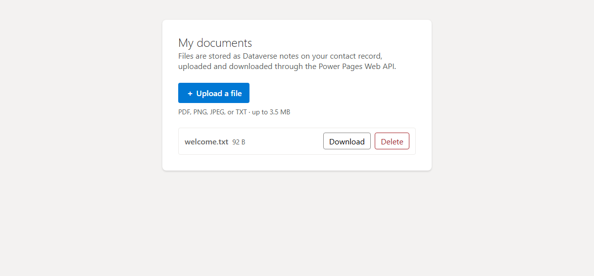

# File Upload (Notes) Sample (React + Vite)

This sample shows how to **upload, list, download, and delete files with the
Power Pages Web API**, storing each file as a Dataverse **note (annotation)**
attached to the signed-in user's own contact record. This is the **notes**
approach — best for small files; for larger/binary-clean files stored in a native
Dataverse **File column**, see the companion *File Upload (File Column)* sample.

The entire lesson is in [`src/fileService.ts`](src/fileService.ts) — the rest of
the app is just UI around it.

## What this teaches

- Uploading a small file as a note with `POST /_api/annotations`, sending the
  content as a base64 `documentbody`.
- Listing a user's files with `$select`/`$filter`/`$orderby`.
- Downloading by reading `documentbody` and decoding the base64 to a Blob.
- Deleting with `DELETE /_api/annotations(<id>)`.
- Sending the CSRF token on every write, and guarding file size and type.

## Screenshot

## Key points

- Notes are bound to the user's contact via
  `objectid_contact@odata.bind: /contacts(<contactId>)`. The contact id comes
  from `window.Microsoft.Dynamic365.Portal.User.contactId`, so the user must be
  signed in.
- Writes (`POST`, `DELETE`) require the `__RequestVerificationToken` header.
  Reads (`GET`) do not.
- This is the **single-request** pattern for small files (capped at ~3.5 MB).
  Larger files need the chunked
  [InitializeAnnotationBlocksUpload / UploadBlock / CommitAnnotationBlocksUpload](https://learn.microsoft.com/power-apps/developer/data-platform/attachment-annotation-files)
  flow.
- Running locally (`npm run dev`) uses an in-memory mock so you can exercise the
  whole UI offline.

## Scripts

- `npm run dev` – Start the local dev server (uses the in-memory mock store).
- `npm run build` – Type-check and build for production into `dist/`.
- `npm run preview` – Preview the production build locally.

## Required configuration

For the live calls to work, the site needs **all** of the following. This sample
ships them under `.powerpages-site/`, but each one is easy to get subtly wrong —
these are the exact pieces that had to be correct before the scenario worked:

1. **Web API enabled for BOTH the `annotation` and `contact` tables.** The note is
   bound to the contact via `objectid_contact@odata.bind: /contacts(<id>)`, so the
   Web API must be able to resolve the `contact` table too — enabling only
   `annotation` returns a 403 on the association. Shipped site settings:
   - `Webapi/annotation/enabled = true`, `Webapi/annotation/fields = *`
   - `Webapi/contact/enabled = true`, `Webapi/contact/fields = *`
2. **Table permissions**, each **assigned to the Authenticated Users web role**
   (the web-role binding is required — a permission with no web role grants nothing):
   - **Contact (Self)** — `contact`, **Self** scope, with **Read + Append + Append To**.
     Append / Append To are what let a note be *attached to* the contact (a create
     bound to `objectid_contact` is an association, not just a create).
   - **Notes on contact** — `annotation`, **Parent** scope, child of *Contact (Self)*,
     with Create / Read / Write / Delete / Append / Append To, **and its
     `parentrelationship` set to `Contact_Annotation`** (the N:1 relationship that
     links a note to its contact).
3. **Authentication** so visitors have a contact record — see [Sign-in is required](#sign-in-is-required).

> ⚠️ **The single easiest thing to miss:** a **Parent-scoped** table permission must
> set its **`parentrelationship`** (here `Contact_Annotation`). Without it, the runtime
> can't build the per-user filter and **every read fails** with a CDS error
> (`9004010A` / HTTP 500) while `create` still succeeds — a confusing "uploads work but
> nothing shows up" symptom. Contact- and Account-scoped permissions need the
> `contactrelationship` / `accountrelationship` equivalents.

> Notes (annotations) store the file in Dataverse and are best for **small files**
> (this sample caps at ~3.5 MB). For larger or binary-clean files, use a native
> Dataverse **file column**; to offload to Azure, see
> [Use Web API to upload files to Azure Blob Storage](https://learn.microsoft.com/power-pages/configure/webapi-azure-blob).

## Sign-in is required

Every operation runs as the **signed-in user's contact** — files are bound to, and
fenced to, that contact (with the secure `Self`/`Parent` scopes above, each user only
ever sees their own files). So:

- Anonymous visitors have no `contactId`; the app shows a **Sign in** button (→ `/SignIn`).
- ⚠️ **Testing gotcha:** previewing a brand-new **trial** site *as its owner* gives a
  **contactless "previewer" session** — `contactId` is empty and uploads won't work even
  though you appear signed in. Sign in as a real authenticated user instead. On a trial
  site, enabling that can require **making the site public, which means converting the
  trial site to production**. This is only a *validation* note — it is **not** a
  requirement of the feature: on a normal production site an authenticated sign-in
  creates the contact automatically.

## Running on Power Pages

### Setup

1. Install [Microsoft Power Platform CLI](https://learn.microsoft.com/power-platform/developer/cli/introduction?tabs=windows#install-microsoft-power-platform-cli) (version >= 1.47.1).
1. Allow `*.js` files by removing it from **Blocked Attachments** in **Privacy + Security** settings for your environment in the Power Pages Admin Center.
1. Open a terminal and `cd` into this `notes` folder.
1. Run `pac auth create --environment <Environment URL>` to log in to your environment.

### Uploading the site

1. Run `npm install` then `npm run build`.
1. Run `pac pages upload-code-site --rootPath .` to upload the site.
1. Go to Power Pages home and click **Inactive sites**. Find **File Upload Sample**
   and click **Reactivate**.
1. Configure authentication and confirm the Web API settings and table permissions
   above are present (including `Webapi/contact/*` and the `parentrelationship`).
1. Click **Preview** and **sign in as an authenticated user** — see
   [Sign-in is required](#sign-in-is-required); the owner-preview session on a trial
   site is contactless — then upload a file and download/delete it.
