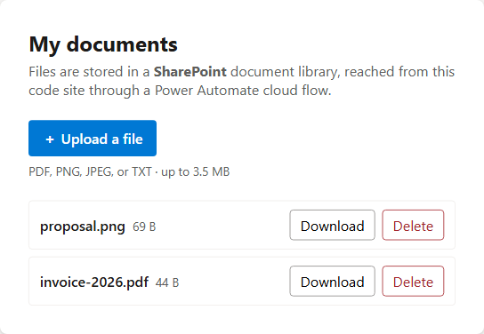

# File Upload to SharePoint Sample (React + Vite)

This sample shows how to **upload, list, download, and delete files in a
SharePoint document library** from a Power Pages **code site (SPA)** — using a
**Power Automate cloud flow** as the bridge.

The entire lesson is in
[`src/sharePointFlowService.ts`](src/sharePointFlowService.ts) — the rest of the
app is just UI around it.

## Why a cloud flow (and not `/_api`)?

Unlike the other three file-upload samples, SharePoint **cannot** be reached from
a code site with the portal Web API:

- The portal Web API (`/_api`) is **Dataverse-data only** — it has no SharePoint
  document-library surface, and it doesn't support actions/functions.
- Power Pages' built-in SharePoint document management renders **only** inside a
  server-side **Liquid / basic-form subgrid**. A code site can't host one:
  [code sites don't support Liquid, the page workspace, or out-of-the-box lists
  and forms](https://learn.microsoft.com/power-pages/configure/create-code-sites#differences-from-existing-power-pages-sites),
  and every server-side route falls back to the SPA root.

So the supported, SPA-friendly path is a **Power Automate cloud flow** that holds
the SharePoint connection. The SPA calls the flow (the same
`/_api/cloudflow/v1.0/trigger/<id>` mechanism as the
[cloud-flow sample](../../cloud-flow-sample/)); the flow does the SharePoint work.

> **Trade-offs.** This bypasses the native `sharepointdocumentlocation` /
> table-permission model — authorization lives in the **flow** instead (here, a
> per-user folder keyed by the contact id). Files travel as **base64 through the
> flow trigger**, which has a request-size ceiling, so this pattern is for **small
> files** (the sample caps at ~3.5 MB).

## How it works (the flow contract)

One flow handles all four operations, switching on an `operation` input. The SPA
calls it with these inputs and reads these outputs:

| Operation | Inputs sent | Outputs read |
| --- | --- | --- |
| `list` | `operation`, `contactId` | `files` (JSON string array of `{id,name,size,modified}`) |
| `upload` | `operation`, `fileName`, `fileContent` (base64), `contactId` | `fileId` |
| `download` | `operation`, `fileId`, `contactId` | `fileName`, `fileContent` (base64), `mimeType` |
| `delete` | `operation`, `fileId`, `contactId` | `status` |

- Every call sends the `__RequestVerificationToken` (CSRF) header **and**
  `X-Requested-With: XMLHttpRequest` (the cloud flow endpoint only accepts AJAX
  requests; without it the call fails with a masked `500` before the flow runs).
- Power Pages **lowercases** the "Respond to Power Pages" output names on the wire
  (`fileName` → `filename`), so the client reads each field case-insensitively.
- `contactId` (from `window.Microsoft.Dynamic365.Portal.User.contactId`) lets the
  flow fence each user to **their own folder** — the SPA can't be trusted to
  enforce that, so the flow must.

## Screenshot

## Set up the flow

Create one flow named **SharePoint Documents** in the same environment as the site.

1. In the design studio: **Set up → Cloud flows → + Create new flow** (or build it
   at [make.powerautomate.com](https://make.powerautomate.com)).
1. **Trigger: When Power Pages calls a flow.** Add these **Text** inputs (titles
   must match exactly): `operation`, `fileName`, `fileContent`, `fileId`,
   `contactId`.
1. Add a **Switch** on `operation` with a case per operation, using the
   **SharePoint** connector against your site + document library:
   - **list** → *List folder* (or *Get files (properties only)*) on the folder
     `/<library>/{contactId}` → build an array of `{id, name, size, modified}` →
     compose it as JSON text.
   - **upload** → *Create file*: folder path `/<library>/{contactId}`, file name
     `fileName`, file content `base64ToBinary(fileContent)`. Return the new
     `fileId`.
   - **download** → *Get file content* by `fileId` → return `fileName`,
     `fileContent` = `base64(...)` of the content, and `mimeType`.
   - **delete** → *Delete file* by `fileId`.
   - (Create the `/<library>/{contactId}` folder on first upload if it doesn't
     exist — *Create new folder* — so each user gets an isolated folder.)
1. End each branch with **Respond to Power Pages** (*Return value(s) to Power
   Pages*), adding the **Text** outputs that operation returns (see the table
   above). Titles must match exactly.
1. **Save**, then **Set up → Cloud flows → + Add cloud flow**, pick the flow, grant
   the **Authenticated Users** web role, and **copy the trigger URL**.
1. Paste the GUID at the end of that URL into:
   - `FLOW_ID` in [`src/config.ts`](src/config.ts), and
   - `processid` / `flowapiurl` in
     [`.powerpages-site/cloud-flow-consumer/sharepoint-documents.cloudflowconsumer.yml`](.powerpages-site/cloud-flow-consumer/sharepoint-documents.cloudflowconsumer.yml).

> ⚠️ The input/output **titles must match exactly (case-sensitive)** the keys the
> client sends/reads in
> [`src/sharePointFlowService.ts`](src/sharePointFlowService.ts). A typo or
> different casing breaks the round-trip silently.

> The shipped `cloud-flow-consumer` metadata registers the flow and grants
> **Authenticated Users** automatically when you `pac pages upload-code-site`, so
> no manual **Add cloud flow** step is needed once `processid` matches your flow.

## Authorization & per-user fencing

- Power Pages authorizes the **call** against web roles bound to the signed-in
  **contact** (the shipped registration grants **Authenticated Users**).
- The flow runs under **its own SharePoint connection**, not the user's — so the
  flow, not Power Pages, must fence data. This sample scopes each user to the
  folder named by their `contactId`. Harden this in the flow for production
  (validate `contactId`, prevent path traversal in `fileId`, etc.).

## Sign-in is required

Every operation runs as the signed-in user's contact (its id selects the
SharePoint folder). Anonymous visitors see a **Sign in** button.

- ⚠️ **Testing gotcha:** previewing a brand-new **trial** site *as its owner* gives
  a **contactless "previewer" session** (`contactId` is empty), so the flow can't
  resolve a folder. Sign in as a real authenticated user — on a trial site that can
  require making the site public, which means converting the trial site to
  production. On a normal production site an authenticated sign-in creates the
  contact automatically.

## Scripts

- `npm run dev` – Start the local dev server (uses an in-memory mock — no flow needed).
- `npm run build` – Type-check and build for production into `dist/`.
- `npm run preview` – Preview the production build locally.

## Running on Power Pages

### Setup

1. Install [Microsoft Power Platform CLI](https://learn.microsoft.com/power-platform/developer/cli/introduction?tabs=windows#install-microsoft-power-platform-cli) (version >= 1.47.1).
1. Create the **SharePoint Documents** flow and set `FLOW_ID` + the consumer YAML
   (see [Set up the flow](#set-up-the-flow)). You also need a SharePoint site +
   document library the flow's connection can reach.
1. Allow `*.js` files by removing it from **Blocked Attachments** in **Privacy + Security** settings for your environment in the Power Pages Admin Center.
1. Open a terminal and `cd` into this `sharepoint` folder.
1. Run `pac auth create --environment <Environment URL>` to log in to your environment.

### Uploading the site

1. Run `npm install` then `npm run build`.
1. Run `pac pages upload-code-site --rootPath .` to upload the site.
1. Go to Power Pages home and click **Inactive sites**. Find
   **File Upload (SharePoint) Sample** and click **Reactivate**.
1. Confirm the flow is **On** and registered to this site, then click **Preview**,
   **sign in as an authenticated user**, and upload a file and download/delete it.
