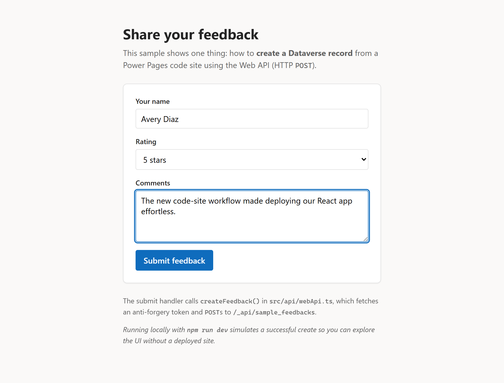

# Power Pages - SPA - Web API: Create a Record

This sample demonstrates **one thing**: how to create a record in a Dataverse
table from a Power Pages code site using the [Power Pages Web API](https://learn.microsoft.com/power-pages/configure/web-api-overview)
(an HTTP `POST`).

It is a small "Share your feedback" form. When the visitor submits, the app
fetches an anti-forgery token and `POST`s a new row to a `Feedback` table.

The entire concept lives in one file: [`src/api/webApi.ts`](src/api/webApi.ts).

## Screenshot



## What you will learn

- How to fetch the **anti-forgery token** that Power Pages requires for every
  unsafe (`POST`/`PATCH`/`DELETE`) Web API request.
- How to **`POST` a new record** to `/_api/<entity-set-name>` with the correct
  OData headers.
- How to read the new record's GUID from the `OData-EntityId` response header.
- How to enable the Web API for a table and grant **Create** with a table
  permission.

## Prerequisites

- Node.js 18 or later
- npm
- Microsoft Power Platform CLI 1.43.6 or later
- A Power Pages site in your environment

## Local development

```powershell
npm install
npm run dev
```

The app runs at `http://localhost:5173`. There is no Power Pages runtime when
running locally, so `createFeedback()` simulates a successful create. This lets
you explore the form without a deployed site. (See the `import.meta.env.DEV`
branch in [`src/api/webApi.ts`](src/api/webApi.ts).)

## Build

```powershell
npm run build
```

The build output is written to `dist`.

## Set up the Dataverse table

This sample writes to a single table. Create it (Power Pages > your site >
Dataverse, or the maker portal at <https://make.powerapps.com>) with these
columns:

| Display name | Schema name | Type | Notes |
| --- | --- | --- | --- |
| Name | `sample_name` | Single line of text | Primary name column |
| Rating | `sample_rating` | Whole number | Range 1-5 |
| Comments | `sample_comments` | Multiple lines of text | |

> The app uses the entity set name `sample_feedbacks` (the plural logical name).
> If you create the table with a different prefix, update `FEEDBACK_ENTITY_SET`
> in [`src/api/webApi.ts`](src/api/webApi.ts).

## Configure Power Pages

The Web API is off by default. Turn it on for the `Feedback` table and allow
visitors to create rows.

### 1. Enable the Web API for the table

Add these two [site settings](https://learn.microsoft.com/power-pages/configure/web-api-overview#site-settings)
to your site:

| Site setting name | Value |
| --- | --- |
| `Webapi/sample_feedback/enabled` | `true` |
| `Webapi/sample_feedback/fields` | `*` |

### 2. Grant Create with a table permission

Create a [table permission](https://learn.microsoft.com/power-pages/security/table-permissions)
on the `Feedback` table:

- **Access type**: Global
- **Permission to**: **Create** (and Append/AppendTo if you later relate it to
  contacts)
- **Web roles**: the role your visitors use. For an anonymous feedback form,
  assign it to **Anonymous Users**; for a signed-in form, use
  **Authenticated Users**.

If Create is not granted, the Web API returns **HTTP 403** and the form shows a
message explaining how to fix it.

## Upload the code site

1. Authenticate with Power Platform CLI:

   ```powershell
   pac auth create --environment <Environment URL>
   ```

1. Allow `*.js` files by removing them from **Blocked Attachments** in
   **Privacy + Security** settings for your environment in the Power Pages admin
   center.

1. Build and upload:

   ```powershell
   npm run build
   pac pages upload-code-site --rootPath .
   ```

1. Reactivate the **Web API Create Record** site from **Inactive sites** in
   Power Pages, then preview it.

## How it works

```ts
// 1. Power Pages requires an anti-forgery token for POST/PATCH/DELETE.
const token = await getAntiForgeryToken() // GET /_layout/tokenhtml

// 2. POST the record to the table's entity set.
await fetch('/_api/sample_feedbacks', {
  method: 'POST',
  headers: {
    'Content-Type': 'application/json',
    'OData-MaxVersion': '4.0',
    'OData-Version': '4.0',
    __RequestVerificationToken: token,
  },
  body: JSON.stringify({
    sample_name: 'Avery',
    sample_rating: 5,
    sample_comments: 'Loved it!',
  }),
})
```

## Project structure

```text
web-api-create-record/
├── public/
│   └── feedback.svg
├── src/
│   ├── api/
│   │   └── webApi.ts          # The Web API create logic (the focus of this sample)
│   ├── components/
│   │   └── FeedbackForm.tsx   # Minimal form that calls createFeedback()
│   ├── App.tsx
│   ├── main.tsx
│   ├── index.css
│   └── vite-env.d.ts
├── index.html
├── package.json
├── powerpages.config.json
├── tsconfig.json
└── vite.config.ts
```

## Technologies used

- [React](https://react.dev/)
- [TypeScript](https://www.typescriptlang.org/)
- [Vite](https://vite.dev/guide/)

## License

MIT
