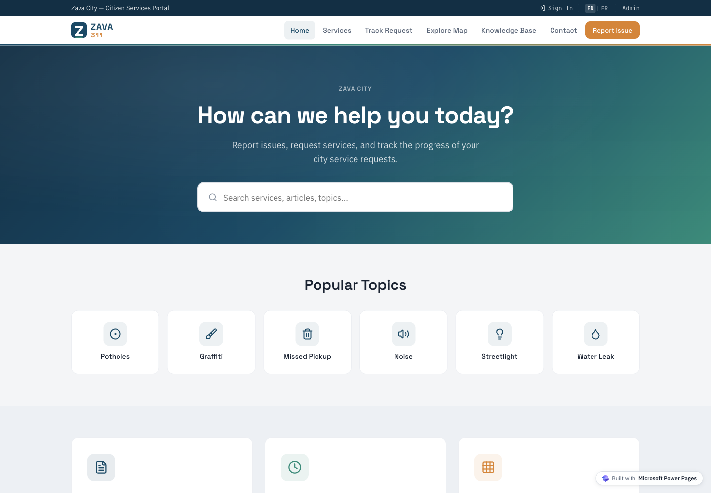
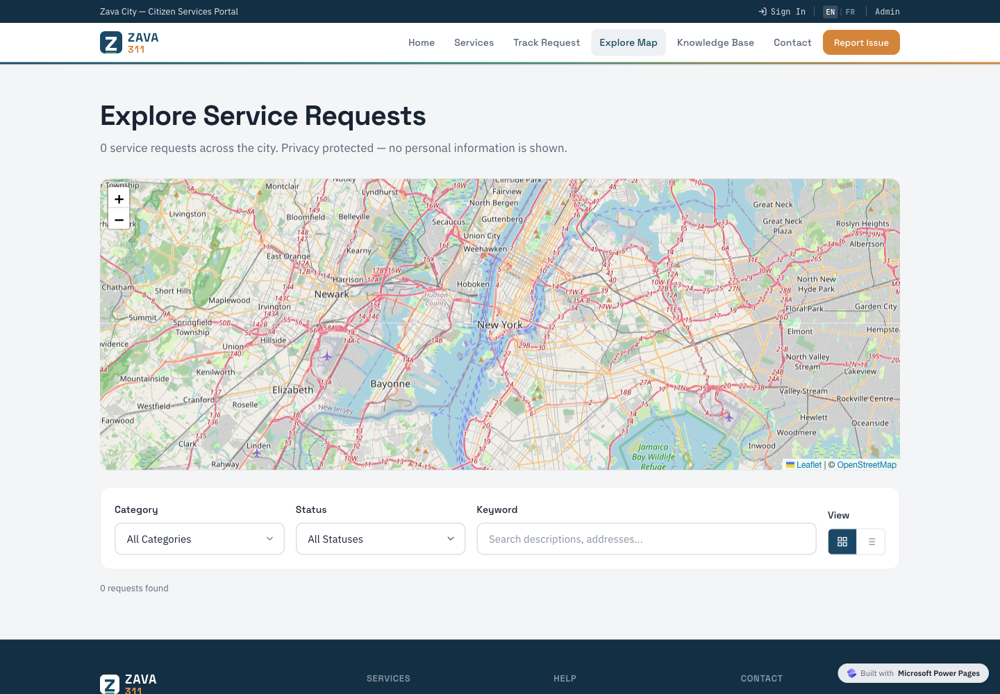
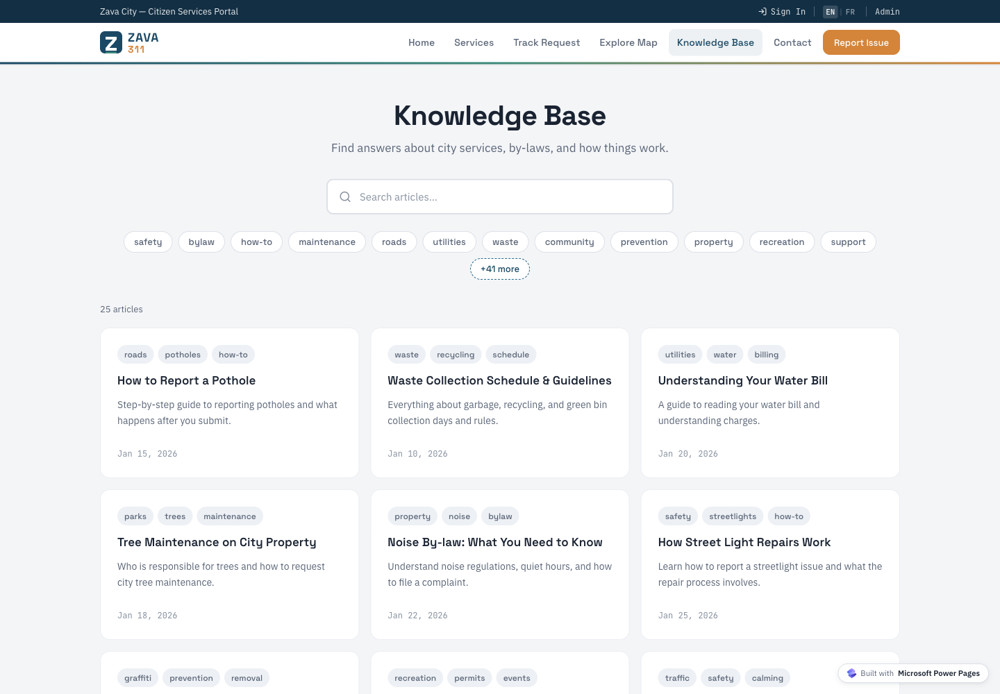
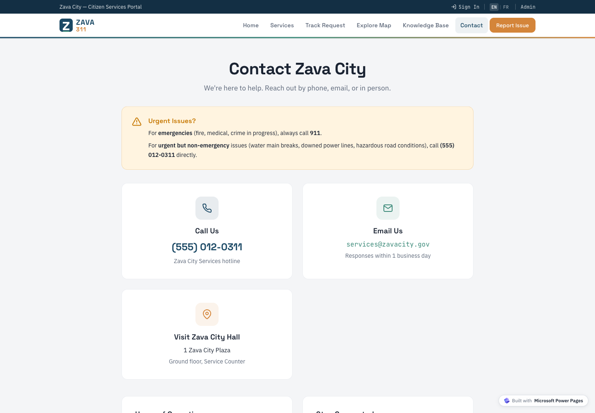
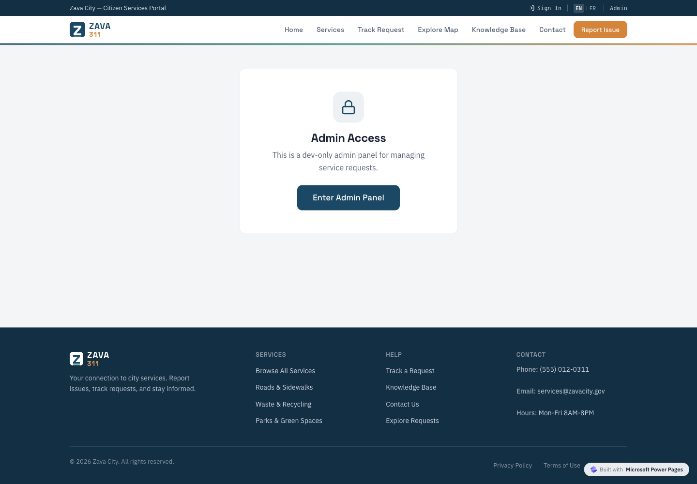

# 311 Portal template

This folder contains the 311 Portal template entry for the installable `templates/` catalog.

The checked-in solution zip is an unmanaged export with the `spa311` publisher prefix.
The solution metadata lists a dependency on Dataverse knowledge articles through `msdynce_KnowledgeManagementFeatures`.

## Previews

| Home | Service request map |
| --- | --- |
|  |  |

| Knowledge base | Contact |
| --- | --- |
|  |  |

| Admin access |
| --- |
|  |

They were captured from the supplied local site build at `~/Downloads/templates-work/311-portal/Site/Zava 311 wo Node`.
The service catalog and service detail pages were not used for previews because they need Dataverse data at runtime.

## Use this template manually

Use these steps if you want to install the template yourself instead of using an installer skill.

1. Install the [Power Platform CLI](https://learn.microsoft.com/power-platform/developer/cli/introduction).
2. Make sure the target environment has Dataverse knowledge article support enabled.
3. Sign in to the target environment:

   ```bash
   pac auth create --url https://YOUR-ENVIRONMENT.crm.dynamics.com
   ```

4. Import the unmanaged solution from the repository root:

   ```bash
   pac solution import --path templates/spa/311-portal/solution/311-portal-unmanaged.zip --publish-changes
   ```

5. Confirm the site and Dataverse tables were created in the target environment.
6. Import `seed/data.json` after the solution import completes.
   The Power Platform CLI solution import command does not import this JSON file.
   Use an installer or a Dataverse import script that understands the seed-data shape below.

Seed data is included under `seed/`.
The seed data uses a Dataverse export shape with `tables`.
It does not include file exports.

If you import the seed data without an installer, create or upsert records table by table using the order in `seed/data.json`.
Preserve the IDs in each table because later records refer to earlier records by lookup ID.
Do not use Dataverse's spreadsheet import for this file because it will not preserve lookup IDs.
