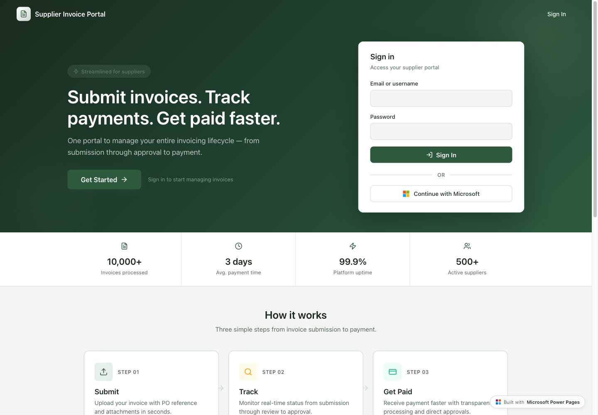

# Power Pages SPA templates

SPA templates are installable Power Pages code-site templates built with familiar frontend frameworks.
Use this index to choose the template that best matches the scenario you want to start from.

## Templates

| Preview | Template family | Variants | Scenario | Includes |
| --- | --- | --- | --- | --- |
|  | [311 Portal](311-portal/) | React + Vite | Citizen service requests and 311 support | Unmanaged solution, Dataverse seed data, service request map, knowledge base, contact flow, and preview images. |
|  | [Supplier Invoice Portal](supplier-invoice-portal/) | React + Vite | Supplier invoices and purchase orders | Unmanaged solution, Dataverse seed data, file-column seed files, invoice workflows, reviewer queue, and preview images. |

## Common workflow

1. Open the template folder.
1. Allow `*.js` files by removing it from `Blocked Attachments` in `Privacy + Security` settings for your environment from Power Pages Admin Center.
1. Pick a framework variant.
1. Import the unmanaged solution zip listed for that variant in the template README.
1. Import `seed-data/data.json` separately if the template family includes seed data.
1. Open the created site in Power Pages and complete any template-specific setup.

For prerequisites, seed-data notes, and manual install commands, see the README in each template folder.
