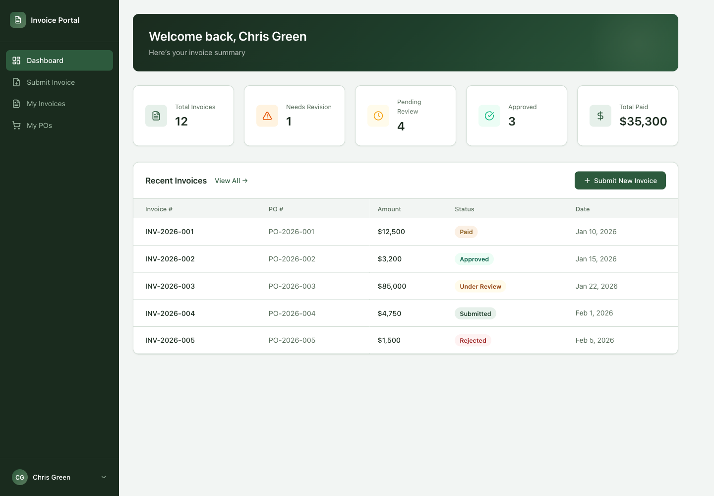
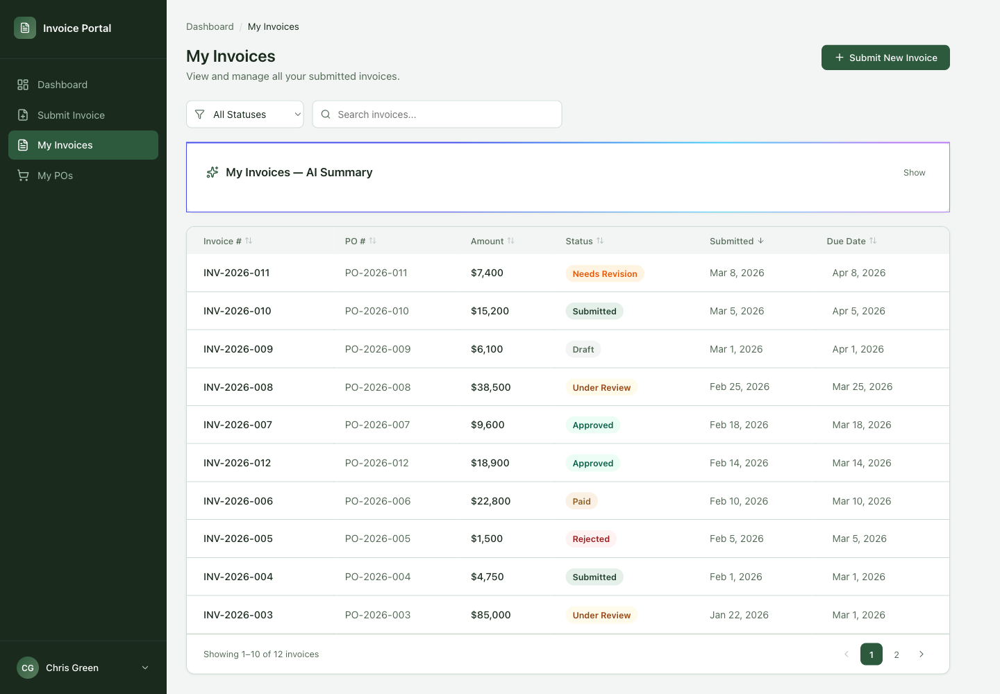
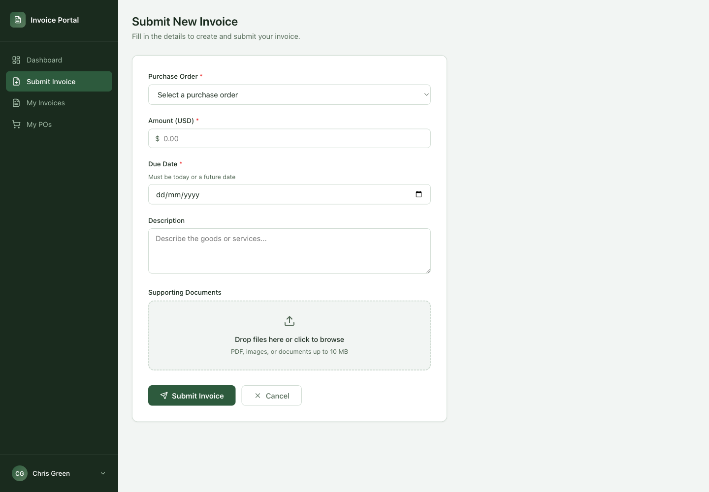
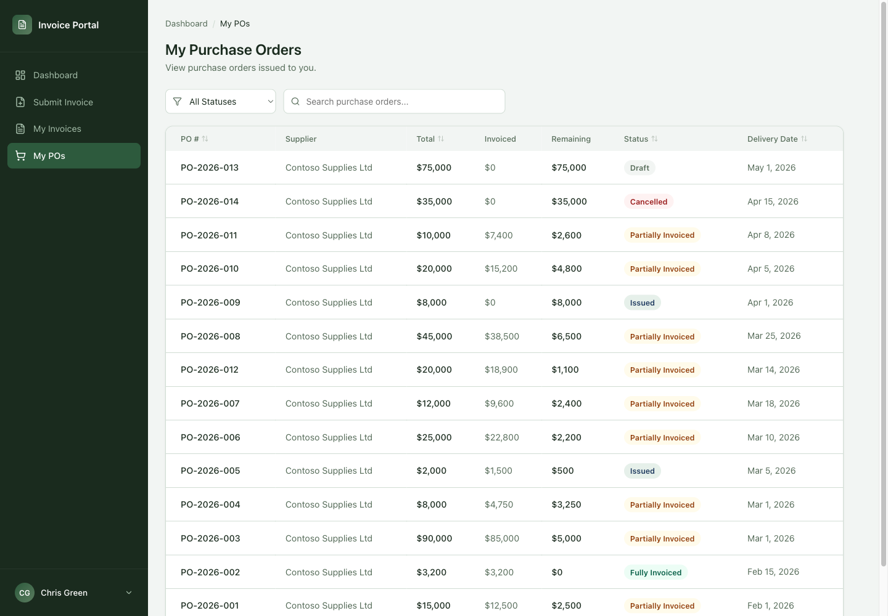
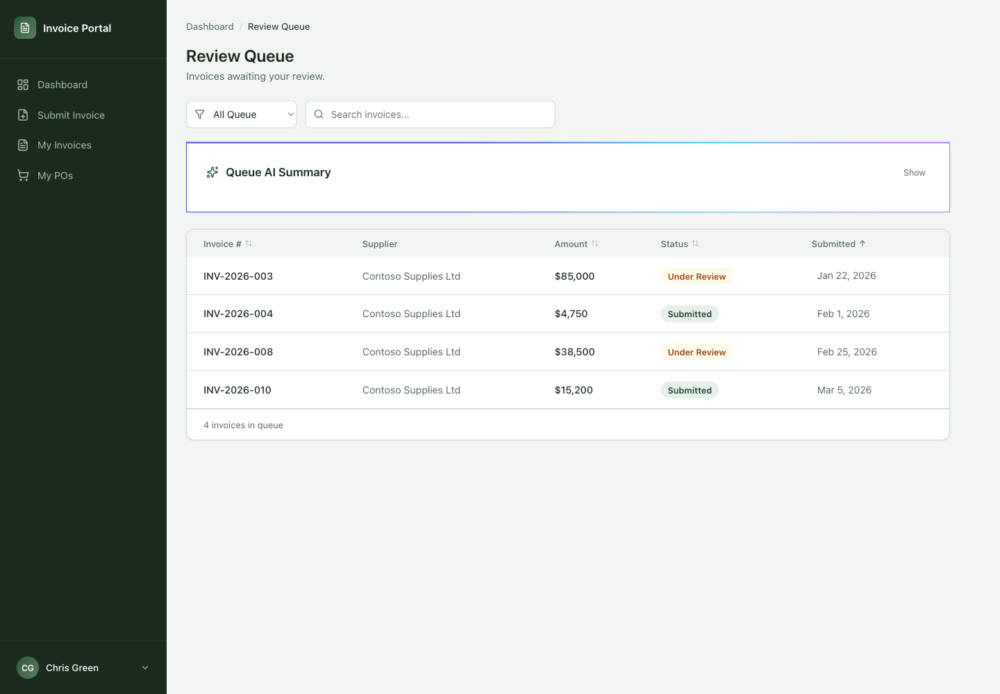

# Supplier Invoice Portal template

This folder contains the Supplier Invoice Portal template entry for the installable `templates/` catalog.

The checked-in supporting solution source is an unpacked unmanaged export with the `spnvc` publisher prefix.
The validator detects the managed state from `solution/Other/Solution.xml`.
It contains Dataverse artifacts only. The Power Pages website project is stored separately under `variants/react/spa-code/`.

## Previews

| Home | Dashboard |
| --- | --- |
|  |  |

| Invoice list | Submit invoice |
| --- | --- |
|  |  |

| Purchase orders | Review queue |
| --- | --- |
|  |  |

## Use this template manually

Use these steps if you want to install the template yourself instead of using an installer skill.

1. Install the [Power Platform CLI](https://learn.microsoft.com/power-platform/developer/cli/introduction).
2. Allow `*.js` files by removing it from `Blocked Attachments` in `Privacy + Security` settings for your environment from Power Pages Admin Center.
3. Make sure English (LCID 1033) is installed in the target Dataverse environment.
4. Sign in to the target environment:

   ```bash
   pac auth create --url https://YOUR-ENVIRONMENT.crm.dynamics.com
   ```

5. Pack and import the React variant's supporting unmanaged solution from the repository root:

   ```bash
   temp_dir="$(mktemp -d)"
   trap 'rm -rf "$temp_dir"' EXIT
   pac solution pack --zipfile "$temp_dir/supplier-invoice-spa-portal-unmanaged.zip" --folder templates/spa/supplier-invoice-portal/variants/react/solution --packagetype Unmanaged
   pac solution import --path "$temp_dir/supplier-invoice-spa-portal-unmanaged.zip" --publish-changes
   ```

6. Confirm the Dataverse tables were created in the target environment.
7. Import `seed-data/data.json` after the solution import completes.
   The Power Platform CLI solution import command does not import this JSON file.
   Use an installer or a Dataverse import script that understands the seed-data shape below.

Seed data is included under `seed-data/`.
The seed data uses a Dataverse export shape with `tables` and `fileExports`.
Files referenced from `fileExports` are stored under `seed-data/files/`.

If you import the seed data without an installer, create or upsert records table by table using the order in `seed-data/data.json`.
Preserve the IDs in each table because later records refer to earlier records by lookup ID.
After the `spnvc_invoiceattachment` records exist, upload each `fileExports` file to the listed Dataverse file column.
Do not use Dataverse's spreadsheet import for this file because it will not preserve lookup IDs or upload file-column binaries.

8. Install dependencies, build the React project, and upload the code site:

```bash
cd templates/spa/supplier-invoice-portal/variants/react/spa-code
npm ci
npm run build
pac pages upload-code-site --rootPath .
```

## Customize this template

The `spa-code/` folder includes the React source, package files, Power Pages configuration, and `.powerpages-site` metadata.
Make changes there, rebuild, and run the upload command again.
