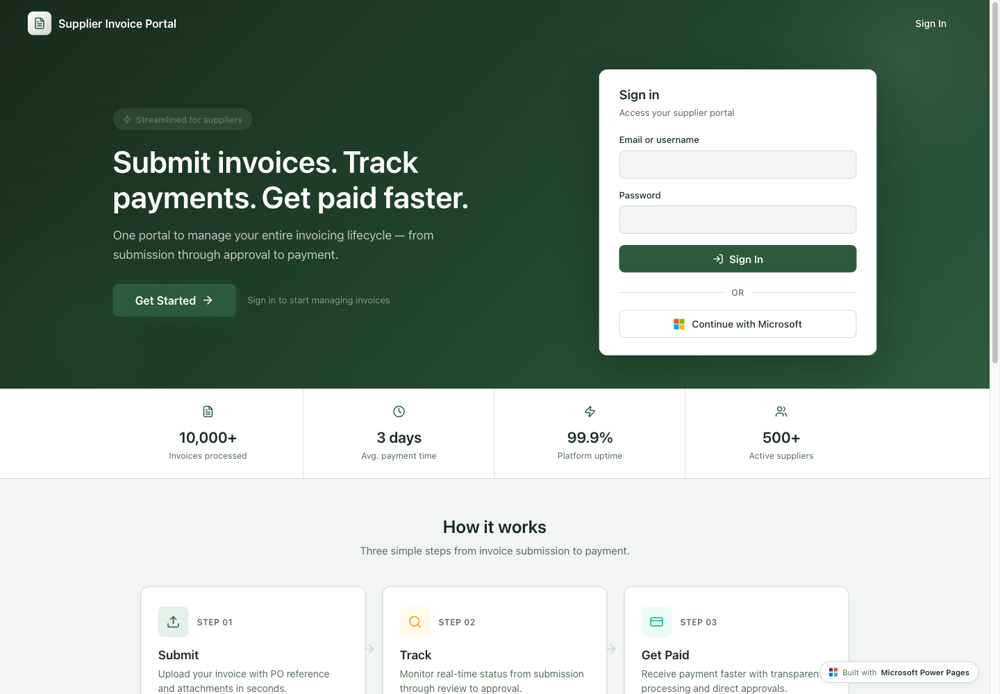
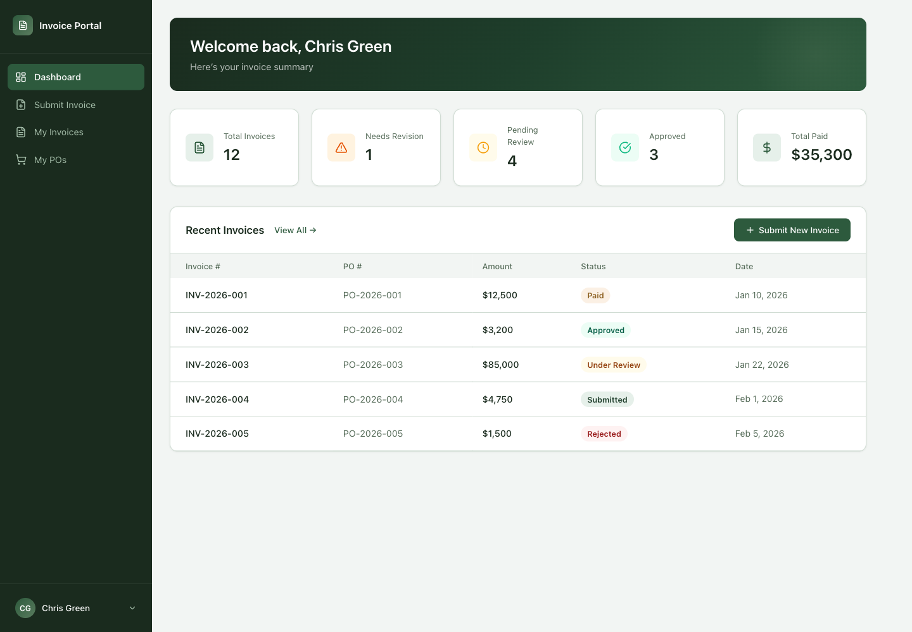
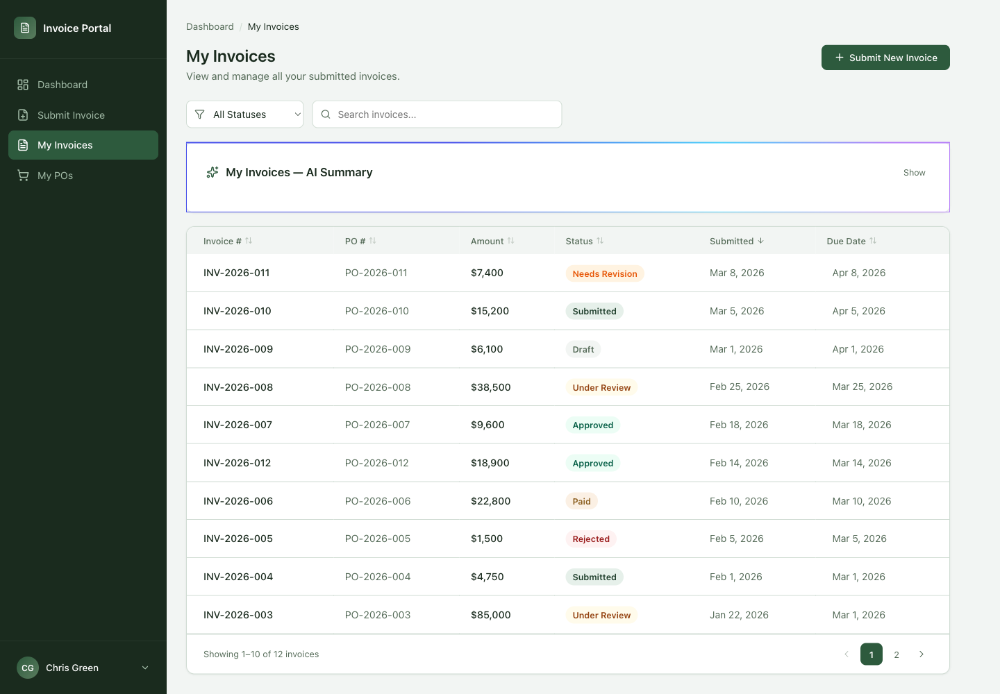
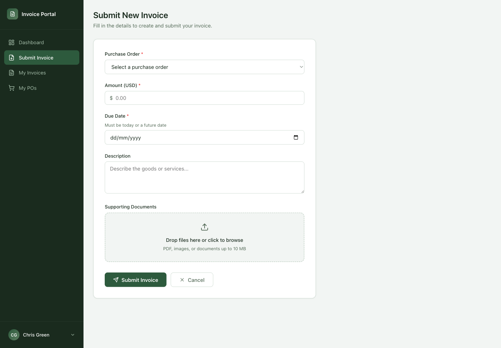
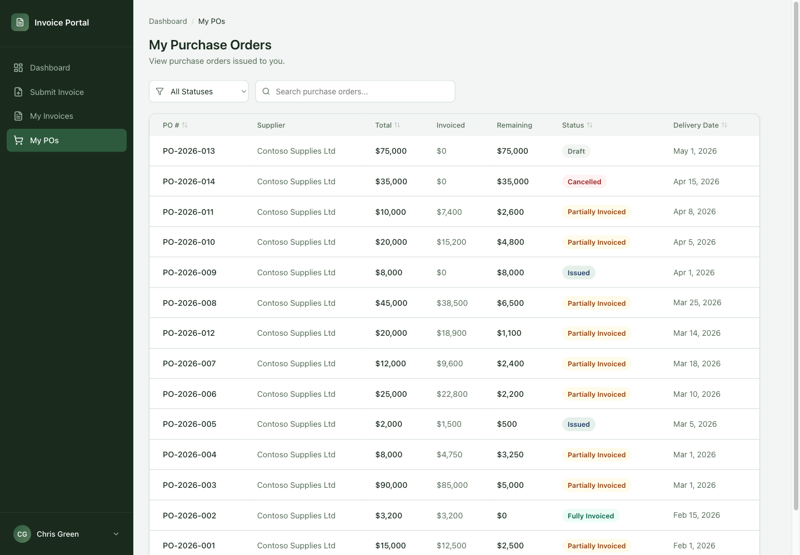
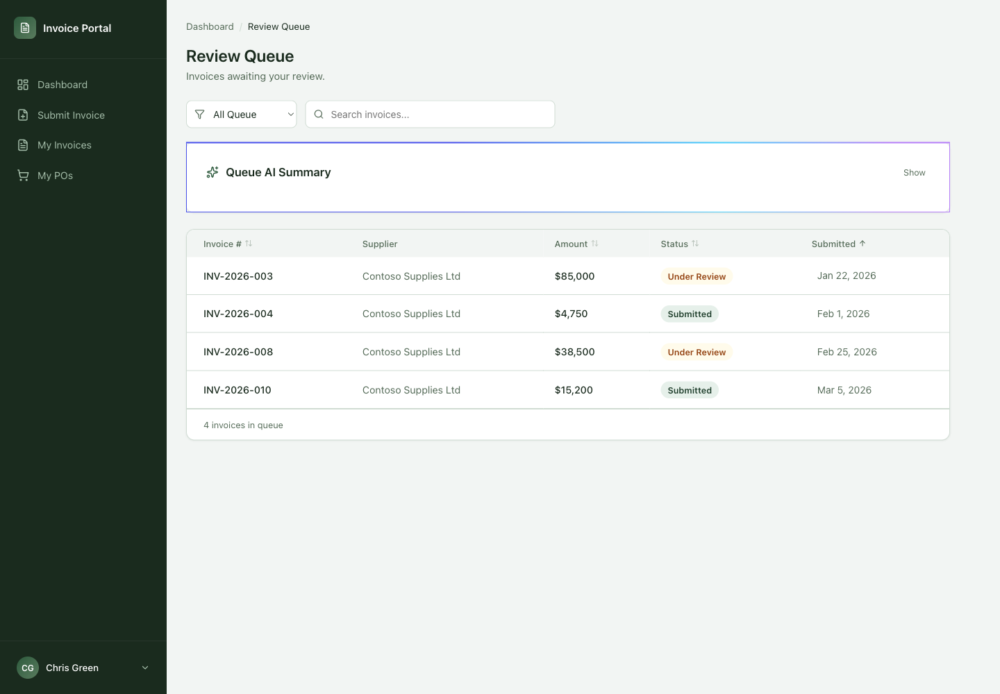

# Supplier Invoice Portal template

The Supplier Invoice Portal is an installable Power Pages SPA for supplier purchase orders, invoice submission, review, attachments, comments, and status tracking, with a shared unmanaged Dataverse solution, sample data, and a React code site under `variants/react/website-code/`.

## Previews

| Home | Dashboard |
| --- | --- |
|  |  |

| Invoice list | Submit invoice |
| --- | --- |
|  |  |

| Purchase orders | Review queue |
| --- | --- |
|  |  |

## Data model

The solution uses standard Dataverse Accounts for supplier businesses and Contacts for portal identities, with active Accounts categorized as Supplier (`accountcategorycode` value `132140000`).

The solution adds four custom tables:
- `spnvc_purchaseorder` stores purchase orders and their supplier Account.
- `spnvc_invoice` stores invoices and their submitter Contact, supplier Account, and purchase order.
- `spnvc_invoicecomment` stores invoice discussion entries.
- `spnvc_invoiceattachment` stores uploaded files linked to an invoice or comment.

The native `spnvc_account_contact` many-to-many relationship assigns Supplier Accounts to reviewer Contacts and appears on the Contact as **Assigned supplier accounts**.
The **Portal Contact (Enhanced)** form includes an **Assigned Supplier Accounts** subgrid that uses the **Active supplier accounts** view.

The case-sensitive lookup navigation properties used by the site and seed data include `spnvc_SupplierAccountId`, `spnvc_PurchaseOrderId`, `spnvc_ContactId`, `spnvc_AuthorContactId`, `spnvc_InvoiceId`, and `spnvc_InvoiceCommentId`.
See [`dataverse-solution-contract.json`](variants/react/website-code/dataverse-solution-contract.json) for the complete contract and the [data model reference](variants/react/website-code/docs/data-model-plan.html) for the shipped columns, choices, and relationship diagram.

### Purchase order amounts

The **Invoiced** amount is the sum of linked invoices in Submitted, Approved, or Paid status, while Draft and Rejected invoices do not contribute.
**Remaining** stops at zero, and an amount above the purchase order total is displayed separately as **Over-invoiced**, even when the progress display stops at 100 percent.
The calculation uses stored monetary values without currency conversion or stored balance and status updates, and existing records need no migration because totals are recalculated when read.

## Configure portal users

Account assignment and web-role assignment are separate steps that must both be completed for every Supplier or Reviewer Contact.

### Supplier

1. Open the supplier business Account and set **Account Category** to **Supplier**.
2. Confirm that the Account is active.
3. In Power Pages Management, open **Security > Contacts** and select the Contact.
4. Open the **Portal Contact (Enhanced)** form and set **Company Name** to the supplier Account.
5. In **Assigned Supplier Accounts**, add the same Account by using **Add Existing Account** and the **Active supplier accounts** view.
6. Assign the **Supplier** site web role.

A Supplier-only Contact should have one Company Name affiliation and no assignments to other supplier Accounts, while multiple Supplier Contacts can share the same Company Name Account and its purchase orders and invoices.

### Reviewer

1. In Power Pages Management, open **Security > Contacts** and select the Contact.
2. Open the **Portal Contact (Enhanced)** form.
3. In **Assigned Supplier Accounts**, add each active Supplier Account that the Contact may review.
4. Assign the **Reviewer** site web role.

You can also manage the relationship from **Related > Assigned supplier accounts**, and removing an Account revokes the reviewer assignment without deleting the Account.

### Contacts with both roles

A Contact can have both roles, with Company Name as the single supplier affiliation and **Assigned Supplier Accounts** holding any additional businesses for review.
The roles are additive, so switching the site's Supplier or Reviewer presentation does not remove permissions granted by the other web role.

In Supplier presentation, **My POs** hides Draft purchase orders and removes Draft from the status filter, while Reviewer presentation retains Draft access.

The invoice list and reviewer queue intentionally have no AI summary card or hidden summarization request.
Summaries on individual invoices and purchase orders depend on the target environment's Power Pages AI settings.

## Install manually

Use these steps when installing the template without an installer skill.

The catalog marks `SupplierInvoiceSPAPortal` with `"publishChanges": true`.
Import it with `pac solution import --publish-changes` so the Portal Contact (Enhanced) assignment grid and its filtered Account view are available.
The PAC publication step can include other pending customizations in the target environment.

### Prerequisites

- Install the [Power Platform CLI](https://learn.microsoft.com/power-platform/developer/cli/introduction).
- Install English (LCID 1033) in the target Dataverse environment.
- Confirm that Power Pages Management and its **Portal Contact (Enhanced)** form are installed.
- In Power Pages Admin Center, open the environment's **Privacy + Security** settings and remove `*.js` from **Blocked Attachments**.
- Install Node.js and npm for the React project.

### Import the supporting solution

1. Sign in to the target environment:

   ```bash
   pac auth create --url https://YOUR-ENVIRONMENT.crm.dynamics.com
   ```

2. From the repository root, pack and import the unmanaged solution:

   ```bash
   temp_dir="$(mktemp -d)"
   trap 'rm -rf "$temp_dir"' EXIT
   pac solution pack --zipfile "$temp_dir/supplier-invoice-spa-portal-unmanaged.zip" --folder templates/spa/supplier-invoice-portal/solutions/SupplierInvoiceSPAPortal --packagetype Unmanaged
   pac solution import --path "$temp_dir/supplier-invoice-spa-portal-unmanaged.zip" --publish-changes
   ```

3. Confirm that the four custom tables, Supplier Account Category option, **Active supplier accounts** view, and Contact assignment subgrid are present.
4. If the target environment already uses Account Category value `132140000`, resolve that conflict before importing or classifying Accounts.

### Import the sample data

The solution import does not import [`seed-data/data.json`](seed-data/data.json).
The seed file contains ordered `tables` and `fileExports`, and its file-column binaries are stored under [`seed-data/files/`](seed-data/files/).
Use an installer or a Dataverse import script that understands this format.

If you write your own importer:
- Process tables in the order stored in `data.json`.
- Import Accounts before Contacts, purchase orders, invoices, comments, and attachments.
- Preserve every record ID because later records use those IDs in lookup bindings.
- Identify sample Accounts by `accountid`, not by company name.
- Stop for review if an existing Account already uses a sample ID.
- Preserve `parentcustomerid_account@odata.bind` and `spnvc_account_contact@odata.bind` when creating Contacts.
- Create attachment records before uploading each file listed in `fileExports`.
- Review the target user's currency before importing the USD examples because source-environment currency IDs are not included.

Do not use Dataverse spreadsheet import for this data because it does not preserve the required IDs and lookup bindings or upload the file-column binaries.
Do not import the sample data into a production environment.

### Build and upload the code site

Run these commands from the repository root:

```bash
cd templates/spa/supplier-invoice-portal/variants/react/website-code
npm ci
npm run build
pac pages upload-code-site --rootPath .
```

The build runs TypeScript, Vite, and the postbuild step that prepares deployment patterns and generated role-bound server scripts.

## Existing installations

This version uses standard Accounts instead of the retired `spnvc_supplier` custom table.
Importing an unmanaged solution update does not migrate existing supplier data, backfill new Account lookups, remove retired components, or update existing permissions.
Follow the [Supplier Account provisioning and migration checklist](variants/react/website-code/docs/dataverse-data-migration.md) before deploying this website over an existing installation.

## Customize the template

Edit the React project in `variants/react/website-code/`, then run `npm run build` and upload the code site again.
Do not edit generated server-script files directly.
The postbuild step generates them from `scripts/business-create-server.js`.
Keep `dataverse-solution-contract.json` and the references under `website-code/docs/` aligned when you change the Dataverse model, permissions, or site behavior.
Refresh Power Pages metadata through the intended PAC workflow and review every generated change before committing it.

## Security and production use

The UI is not an authorization boundary.
Before production use, review the shipped web roles and table permissions, remove any broader legacy grants, and test Supplier, Reviewer, dual-role, unassigned, and cross-company Contacts in a target environment.
Verify Company Name, Account Category, active state, and **Assigned Supplier Accounts** membership before granting a business role.
Keep Account assignments and web roles administrator-managed, and do not expose broader Web API fields or table permissions to work around an access error.
